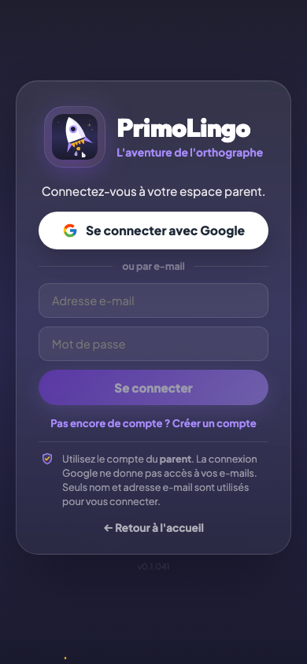
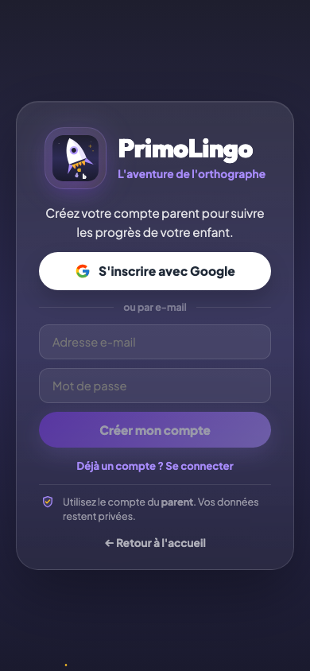

# Inscription et connexion

## Description

PrimoLingo propose deux méthodes de connexion : Google et e-mail/mot de passe. Le parent se connecte, accède à son tableau de bord, et crée ensuite un ou plusieurs profils enfants via un assistant de configuration guidé (wizard).

## Parcours utilisateur

### 1. Arrivée sur la page de connexion

La page de connexion propose deux options : se connecter avec Google ou avec un e-mail et un mot de passe. Un lien permet de basculer entre le mode connexion et le mode création de compte.



### 2. Connexion avec Google

L'utilisateur clique sur "Se connecter avec Google". Sur iOS Safari, l'app utilise un flux de redirection (au lieu d'une popup) pour contourner les restrictions du navigateur. Sur les autres navigateurs, une popup s'ouvre.

En mode **création de compte**, Google affiche la sélection de compte (`select_account`) pour forcer le choix explicite. En mode **connexion**, la session est réutilisée directement si disponible.

### 3. Connexion par e-mail

L'utilisateur saisit son adresse e-mail et son mot de passe, puis clique sur "Se connecter". Si les identifiants sont corrects, il est redirigé vers le tableau de bord parent.

En cas d'erreur, un message en français s'affiche : mot de passe incorrect, compte inexistant, trop de tentatives, etc.

### 4. Création de compte par e-mail

En cliquant sur "Pas encore de compte ? Créer un compte", le formulaire bascule en mode inscription. Le bouton Google affiche "S'inscrire avec Google" et le bouton e-mail affiche "Créer mon compte". Le mot de passe doit faire au moins 6 caractères.



### 5. Premier accès — wizard de configuration

À la première connexion, au lieu d'être redirigé directement vers le tableau de bord, le parent est guidé par un assistant de configuration en 5 étapes. Voir [Tableau de bord parent](02-gestion-enfants.md) pour le détail du wizard.

### 6. Connexions suivantes

Le parent arrive directement sur son tableau de bord. Sa méthode de connexion est affichée en bas de la page parent : "Connexion Google" ou "Connexion Email" (sans pastille).

### 7. Déconnexion

Le parent peut se déconnecter à tout moment depuis le tableau de bord. La déconnexion ramène à la page d'accueil.

## Code parental

### À quoi sert le code parental ?

Le code parental est un code à 4 chiffres défini lors du wizard de configuration. Il sert à protéger certaines actions dans l'app enfant :

- **Sauver la flamme après une absence** : quand l'enfant revient après un jour sans quiz, l'app propose de récupérer sa série. Le parent tape son code pour valider.
- **Accéder au tableau de bord parent** : depuis l'app enfant, le bouton de retour parent demande le code pour empêcher l'enfant d'accéder aux réglages.

### Configuration

Le code est défini à l'étape 1 du wizard lors de la première connexion. Il peut être modifié à tout moment depuis le tableau de bord parent.


### Saisie côté enfant

Quand le code est requis (récupération de flamme, retour parent), l'enfant voit un écran de saisie et doit demander à son parent de taper le code.


### Sécurité

- Le code est haché (SHA-256 + salt) avant d'être stocké. Le PIN en clair n'est jamais enregistré.
- Les anciens PINs en clair (migration) sont automatiquement hachés lors de la première saisie correcte.
- Si aucun code n'est défini, les actions protégées restent accessibles sans vérification.

## Tests

La suite `auth-flow.test.js` couvre l'ensemble du flux d'authentification.

**Mode rapide** (bypass Firebase, pour CI et développement quotidien) :
```bash
npm run test:auth
```

**Mode réel** (connexion Firebase effective avec le compte test) :
```bash
npm run test:auth:real
```

Le compte test est `test-parent@primolingo.fr` / `Test1234!`. Il sert uniquement à valider le vrai flux de connexion e-mail et la redirection vers `/parent`.

## Règles

| ID | Règle | Critère de succès |
|----|-------|-------------------|
| L01 | Deux méthodes de connexion : Google et e-mail/mot de passe | Les deux options sont visibles sur la page de connexion |
| L02 | La première connexion ouvre le wizard de configuration | Après la première auth, le parent voit le wizard 5 étapes |
| L03 | Après connexion (retour), le parent arrive sur son tableau de bord | La route `/parent` est protégée et redirige les anonymes vers `/login` |
| L04 | La session reste active tant que le parent ne se déconnecte pas | Firebase Auth est configuré avec `browserLocalPersistence` |
| L05 | Le code parental est haché avant stockage | Aucun PIN en clair dans Firestore ou localStorage |
| L06 | Les erreurs de connexion sont affichées en français | Mot de passe incorrect, compte inexistant, etc. |
| L07 | Le CTA "Créer un compte gratuit" ouvre la page de connexion en mode inscription | L'URL est `/login?mode=register`, le bouton affiche "S'inscrire avec Google" |
| L08 | Google sign-up force la sélection de compte | `select_account` prompt actif uniquement en mode inscription |
| L09 | Safari iOS utilise le flux redirect pour Google | Pas de popup sur iOS Safari, redirection complète |

## Voir aussi

- [Tableau de bord parent](02-gestion-enfants.md) — Wizard de configuration et pilotage de la progression
- [Code PIN parental](17-code-pin-parental.md) — Détail du verrouillage par code
