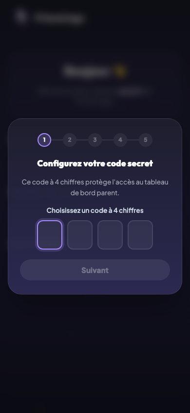
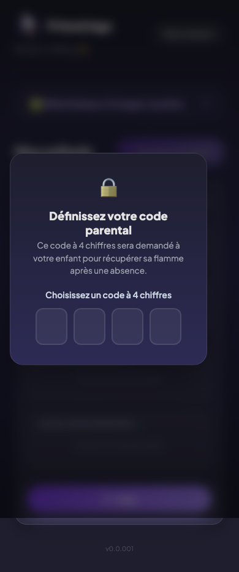
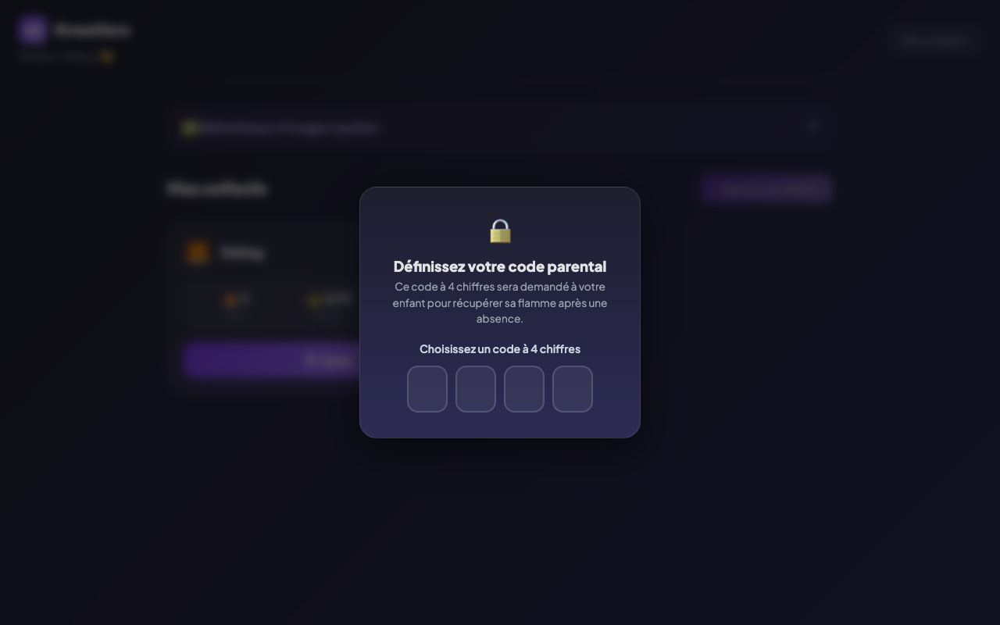
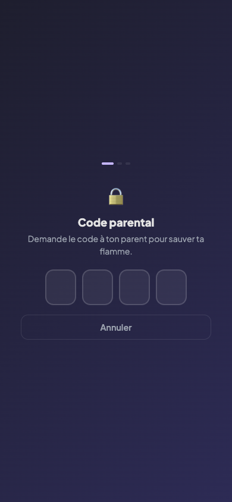

# Inscription et connexion

## Description

PrimoLingo utilise la connexion Google pour créer un compte parent. Le parent se connecte, accède à son tableau de bord, et crée ensuite un ou plusieurs profils enfants. Il n'y a pas de mot de passe à retenir : tout passe par le compte Google.

## Parcours utilisateur

### 1. Arrivée sur la page de connexion

L'utilisateur arrive sur la page d'accueil de PrimoLingo. Un bouton "Se connecter avec Google" est affiché au centre de l'écran.

### 2. Authentification Google

L'utilisateur clique sur le bouton et est redirigé vers la page de connexion Google. Il choisit son compte ou en crée un. Aucune information personnelle au-delà du nom et de l'adresse e-mail n'est demandée.

### 3. Redirection vers le tableau de bord parent

Une fois authentifié, le parent est automatiquement redirigé vers son tableau de bord. S'il se connecte pour la première fois, le tableau de bord est vide et l'invite à créer un premier profil enfant.

### 4. Déconnexion

Le parent peut se déconnecter à tout moment depuis le tableau de bord. La déconnexion ramène à la page d'accueil.

## Code parental

### À quoi sert le code parental ?

Le code parental est un code à 4 chiffres défini par le parent depuis son tableau de bord. Il sert à protéger certaines actions sensibles dans l'app enfant :

- **Sauver la flamme après une absence** : quand l'enfant revient après un jour sans quiz, l'app propose de récupérer sa série (streak). Pour éviter que l'enfant ne le fasse seul sans effort, le code parental est demandé. Le parent décide si la flamme mérite d'être sauvée.
- **Accéder au tableau de bord parent** : depuis l'app enfant, le bouton "Retourner sur l'app parent" demande le code parental pour empêcher l'enfant d'accéder aux réglages.

### Configuration

Le parent définit son code depuis le tableau de bord parent en cliquant sur "Code parental". Une modale apparaît avec un clavier à 4 cases.

### Saisie côté enfant

Quand le code est requis (récupération de flamme, retour parent), l'enfant voit un écran de saisie et doit demander à son parent de taper le code.

### Sécurité

- Le code est haché (SHA-256 + salt) avant d'être stocké. Le PIN en clair n'est jamais enregistré.
- Si aucun code n'est défini, les actions protégées restent accessibles sans vérification.

## Règles

| ID | Règle | Critère de succès |
|----|-------|-------------------|
| — | Le bouton Google est le seul moyen de connexion | Aucun formulaire e-mail/mot de passe n'est proposé |
| — | La première connexion crée automatiquement le compte | Le parent n'a aucune étape d'inscription supplémentaire |
| — | Après connexion, le parent arrive sur son tableau de bord | La redirection est immédiate, sans page intermédiaire |
| — | La session reste active tant que le parent ne se déconnecte pas | En revenant sur l'app, le parent est toujours connecté |
| — | Le code parental est haché avant stockage | Aucun PIN en clair dans Firestore ou localStorage |

## Voir aussi

- [Gestion des enfants](02-gestion-enfants.md) — Créer le premier profil enfant
- [Tableau de bord parent](16-tableau-bord-parent.md) — Vue complète du tableau de bord parent
