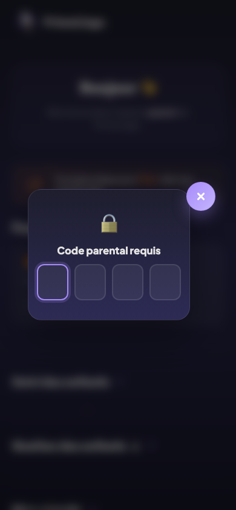
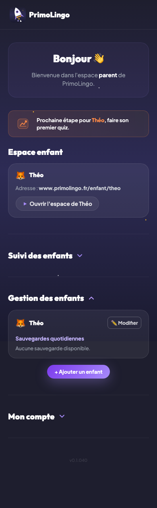
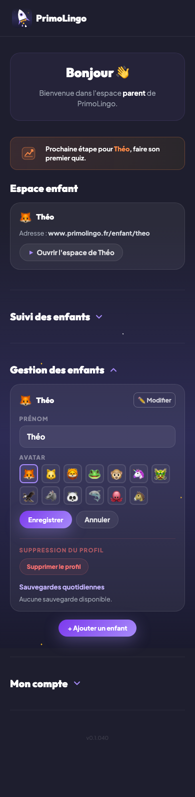
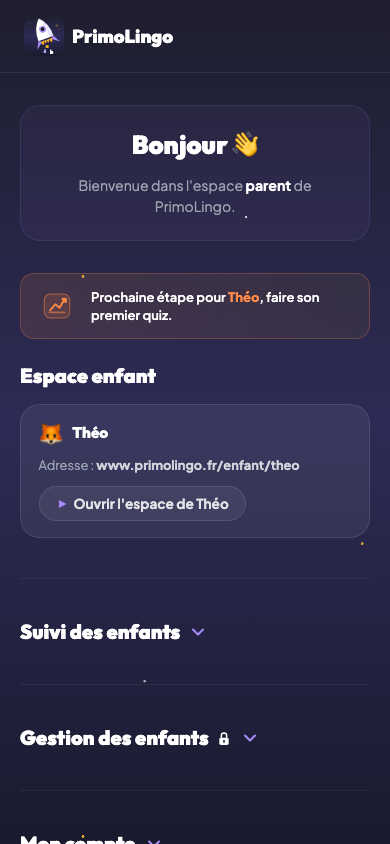

# Tableau de bord parent

## Description

Le tableau de bord parent est l'espace de pilotage de PrimoLingo. Le parent y crée les profils enfants, consulte leur progression, ajuste les réglages par enfant et gère les sauvegardes. Chaque enfant possède son propre espace de jeu, séparé des autres profils et du compte parent.

---

## Wizard de configuration (première connexion)

À la première connexion, le parent est guidé par un assistant de configuration en 5 étapes. Le wizard s'affiche en modale plein écran et ne peut pas être fermé avant d'être terminé.

Le wizard est persistant : si le parent ferme l'onglet ou perd sa connexion en cours de route, il reprend exactement à l'étape où il s'était arrêté à la prochaine connexion.

### Étape 1 — Configurez votre code secret

Le parent choisit un code à 4 chiffres. Il doit le saisir deux fois pour confirmation. En cas de discordance, un message d'erreur invite à recommencer. Le code est haché (SHA-256 + salt) avant d'être enregistré — il n'est jamais stocké en clair.

### Étape 2 — Ajouter un enfant

Le parent saisit le prénom de son premier enfant et choisit un avatar parmi 13 options. Au moins un enfant est requis pour continuer.

### Étape 3 — Ajoutez cette page à vos favoris

L'app invite le parent à mettre `www.primolingo.fr/parent` en favori pour retrouver facilement l'espace parent.

> Cela vous permettra de la retrouver facilement.
> Son adresse est **www.primolingo.fr/parent**

### Étape 4 — Configurez l'app pour votre enfant

Le parent indique si son enfant jouera sur **cet appareil** ou sur un **autre appareil**.

**Si même appareil :** L'app affiche les liens directs vers l'espace de jeu de chaque enfant (`www.primolingo.fr/enfant/{prénom}`). Le parent ouvre le lien, met la page en favori, puis revient terminer le wizard.

> Lorsque le parent ouvre l'espace enfant depuis ce lien, un banner violet apparaît en bas de l'écran :
> *"Espace de jeu de [prénom] — Mettez cette page en favori pour que [prénom] puisse y accéder facilement."*
> Ce banner s'affiche une seule fois et disparaît après avoir cliqué "Compris". Il ne réapparaît plus sur cet appareil (le dismiss est stocké en localStorage). Sur un autre appareil, il s'affichera à nouveau si l'URL contient `?from=onboarding`.

**Si autre appareil :** L'app donne les instructions pour se connecter depuis l'appareil de l'enfant avec le même compte parent.

> Note : si le parent ne termine pas cette étape immédiatement, le wizard reprend à l'étape 4 à la prochaine connexion. La progression est sauvegardée automatiquement — le parent n'a pas à recommencer depuis le début.

### Étape 5 — C'est tout bon

Écran de confirmation. Si l'enfant jouera sur un autre appareil, un rappel invite le parent à terminer la configuration depuis cet appareil. Le bouton "Terminer" ferme le wizard et affiche le tableau de bord.

---

## Tableau de bord parent

Après le wizard (ou à chaque reconnexion), le parent arrive sur son tableau de bord. Il voit la liste de ses enfants avec, pour chacun, un résumé de progression.

### Message de coaching — premier quiz

Si un ou plusieurs enfants n'ont pas encore fait leur premier quiz, un banner de coaching orange s'affiche en haut du tableau de bord :

> *"Prochaine étape pour [prénom(s)], faire son/leur premier quiz."*

Le banner liste uniquement les enfants concernés et disparaît automatiquement dès que tous ont fait au moins un quiz.

### Identifiant de connexion

En bas du tableau de bord, la méthode de connexion du parent est affichée : **Connexion Google** ou **Connexion Email** — sans pastille ni badge.

---

## Gestion des enfants

> Cette section est verrouillée par code parental. Le parent doit saisir son code à 4 chiffres pour y accéder.

### Ajouter un enfant

Depuis le tableau de bord, le bouton "Ajouter un enfant" ouvre un formulaire permettant de saisir le prénom et de choisir un avatar.

### Modifier un profil

Le parent peut changer le prénom d'un enfant depuis les réglages de son profil.

### Réglages par enfant

Les réglages sont accessibles depuis l'icône engrenage de la carte enfant.

- **Questions signalées** : si l'enfant signale une question pendant un quiz, le parent peut la consulter, la télécharger ou l'effacer.
- **Restauration de sauvegarde** : restaurer la progression à partir d'une sauvegarde quotidienne.

> Note : la section "Images mystère" est temporairement masquée dans le tableau de bord parent. La fonctionnalité reste active dans le code.

### Sauvegardes

Après chaque session, une sauvegarde automatique est créée avec l'état complet de la progression : pièces, flamme, boutique, règles et niveaux. Conservées sur 30 jours glissants.

Le parent peut consulter une sauvegarde et la restaurer. Chaque sauvegarde affiche la date, le nombre de pièces et les jours de flamme au moment de la sauvegarde.

---

## Accéder à l'espace de jeu

Depuis la carte d'un enfant, le parent peut ouvrir l'espace de jeu de l'enfant. L'URL est `www.primolingo.fr/enfant/{prénom}`.

---

## Consulter la progression

En sélectionnant un enfant, le parent consulte :

- les règles travaillées et leur niveau (Bronze, Argent, Couronne, Diamant) ;
- l'historique de la flamme ;
- le nombre de sessions jouées ;
- les pièces accumulées.

---

## Isolation des données

Chaque enfant a sa propre progression. Les données d'un enfant ne peuvent pas écraser celles d'un autre, même si plusieurs profils existent sur le même compte parent.

---

## Règles

| ID | Règle | Critère de succès |
|----|-------|-------------------|
| W01 | Le wizard s'affiche à la première connexion | Après la première auth, le parent voit les 5 étapes |
| W02 | Le PIN est requis avant de passer à l'étape 2 | Impossible d'avancer sans avoir saisi et confirmé un code |
| W03 | Au moins un enfant est requis pour passer à l'étape 3 | Le bouton "Suivant" est désactivé si aucun enfant n'a été ajouté |
| W04 | Le choix appareil (étape 4) est requis pour avancer | Les deux options (oui/non) doivent être proposées |
| W05 | Les liens enfant en étape 4 incluent `?from=onboarding` | Le banner bookmark s'affiche à l'ouverture |
| W06 | Le banner bookmark est one-shot par appareil | Il disparaît après "Compris" et ne réapparaît plus sur cet appareil (localStorage) |
| W07 | Le wizard reprend à l'étape en cours en cas d'interruption | À la reconnexion, le parent ne recommence pas depuis l'étape 1 |
| N26 | Les données sont isolées par enfant | Chaque enfant a sa propre progression |
| N29 | Les sauvegardes sont créées automatiquement | Après une session, un snapshot est sauvegardé |
| N30 | Les sauvegardes sont restaurables | Un backup relu retourne les mêmes pièces et la même flamme |
| D01 | Le banner coaching "premier quiz" s'affiche si nécessaire | Visible tant qu'un enfant a 0 sessions, adapté au nombre d'enfants concernés |

## Voir aussi

- [Inscription et connexion](01-inscription-connexion.md) — Créer le compte parent
- [Dashboard enfant](03-dashboard-enfant.md) — Ce que l'enfant voit après la configuration
- [Code PIN parental](17-code-pin-parental.md) — Détail du verrouillage par code
