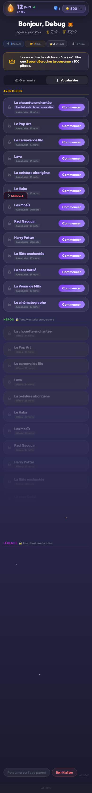
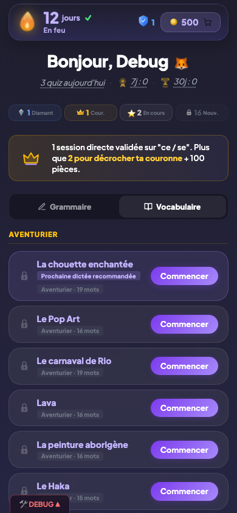

# Dashboard enfant

## Description

Le dashboard est l'écran d'accueil du joueur. C'est le point de départ de chaque session : l'enfant y retrouve sa flamme, ses pièces, son personnage, un message de coaching personnalisé, la liste de ses règles de grammaire organisées par niveau, et un onglet pour accéder aux dictées.

## Parcours utilisateur

### 1. Écran d'accueil

En ouvrant l'app, l'enfant arrive sur le dashboard. En haut, il voit son prénom dans le message d'accueil, sa flamme avec le compteur de jours consécutifs, et son nombre de pièces. Son personnage compagnon est affiché avec une animation.

### 2. La flamme en en-tête

La flamme est toujours visible en haut de l'écran. Elle indique le nombre de jours consécutifs de jeu. Son apparence change selon les paliers atteints (7, 14, 30 jours...). Si l'enfant a acheté une flamme cosmétique en boutique, elle remplace l'icone par défaut.

### 3. Le compteur de pièces

Les pièces s'affichent à cote de la flamme. Ce compteur est mis à jour en temps réel après chaque session de quiz, chaque bonus ou chaque achat en boutique.

### 4. Le bouclier

Si l'enfant possède un ou deux boucliers, une icone bouclier apparait dans le header avec le nombre restant. Les boucliers protègent la flamme en cas d'absence.

### 5. Le message d'accueil

En haut du dashboard, un message salue l'enfant par son prenom. Le texte varie selon l'heure :

| Heure | Message |
|-------|---------|
| Avant 6h | "Debout tot, [prenom]" |
| 6h - 12h | "Bonjour, [prenom]" |
| 12h - 18h | "Bon apres-midi, [prenom]" |
| Apres 18h | "Bonsoir, [prenom]" |

L'emoji avatar de l'enfant s'affiche directement apres le prenom. En cliquant dessus, un selecteur inline apparait sous le message d'accueil et permet a l'enfant de choisir un nouvel avatar parmi les 13 disponibles. La modification est sauvegardee immediatement.

### 6. Les micro-stats du header

Trois compteurs sont affiches sous la flamme et les pieces :

- **Quiz aujourd'hui** : nombre de sessions (grammaire + dictee) terminees aujourd'hui. Remis a zero a minuit.
- **Record 7j** : nombre maximum de sessions jouees en un seul jour au cours des 7 derniers jours.
- **Record 30j** : meme calcul sur les 30 derniers jours.

Les records comptent toutes les sessions terminees (grammaire et dictee, modes guide et direct confondus), quel que soit le score obtenu. Il n'y a pas de seuil minimum : une session terminee est comptabilisee, meme si l'enfant a fait beaucoup d'erreurs.

### 7. Le selecteur Grammaire / Vocabulaire

Un onglet permet de basculer entre les regles de grammaire et les dictees (vocabulaire). La regle d'affichage par defaut est : **l'onglet avec le moins de diamants s'ouvre en premier**, pour encourager l'enfant a equilibrer sa progression entre les deux.

### 8. Le message de coaching

Sous le header, un bandeau affiche un message personnalisé d'une phrase. Ce message oriente l'enfant vers la prochaine action utile : lancer une révision due, dépenser ses pièces en boutique, viser un palier de flamme, ou débloquer une nouvelle règle. Le message change chaque jour selon la situation du joueur.

### 9. La liste des règles

Les règles de grammaire sont organisées en trois sections :

- **Révisions** (en haut) : les règles au niveau Diamant dont la révision est prévue aujourd'hui. Cette section n'apparait que si au moins une révision est due.
- **En cours** : les règles déjà commencées (niveau Bronze ou supérieur).
- **A découvrir** : les règles que l'enfant n'a pas encore essayées.

Chaque règle affiche son niveau actuel (Bronze, Argent, Couronne, Diamant) avec un badge visuel.

### 10. L'onglet Dictée

L'onglet Vocabulaire (accessible via le selecteur decrit en section 7) donne acces aux sessions d'ecoute et de saisie de mots.

## Règles

| ID | Règle | Critère de succès |
|----|-------|-------------------|
| E01 | Le dashboard affiche la flamme, les pièces et le personnage dès l'ouverture | Les trois éléments sont visibles sans défilement sur l'écran d'accueil |
| E02 | Les règles sont triées en trois sections : Révisions, En cours, A découvrir | La section Révisions apparait en premier si au moins une révision est due, suivie de En cours puis A découvrir |

## Voir aussi

- [Flamme et série](04-flamme-serie.md) — Détail du compteur de flamme et des paliers
- [Règles de grammaire](05-regles-grammaire.md) — Catalogue des 20 règles et niveaux
- [Dictée](10-dictee.md) — L'onglet dictée et ses trois niveaux
- [Coaching et messages](15-coaching-messages.md) — Les messages contextuels du bandeau
