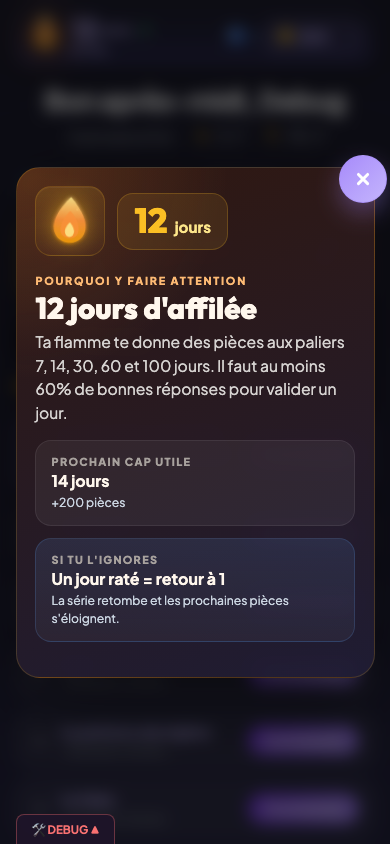
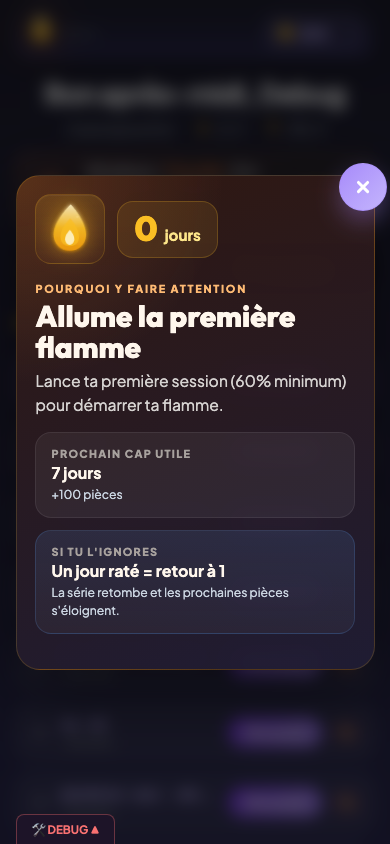
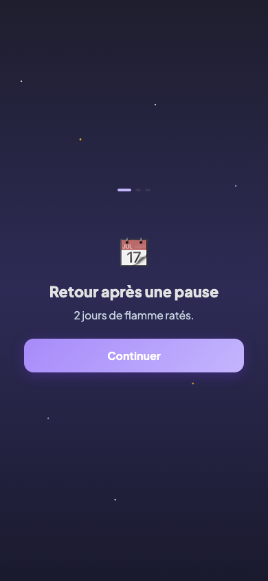

# Flamme et série

## Description

La flamme est le compteur de jours consécutifs où l'enfant a terminé au moins une session de quiz avec un score suffisant (12/20 minimum sur une session de 20 questions). Elle est au coeur de la motivation quotidienne : chaque jour sans jouer met la flamme en danger. Des paliers récompensent la régularité, et le bouclier permet de protéger la flamme en cas d'absence.

## Parcours utilisateur

### 1. La flamme au quotidien

Chaque jour, la première session qualifiante (score supérieur ou égal à 60 %) fait progresser la flamme d'un jour. Le compteur s'incrémente et l'enfant voit la flamme s'animer.

### 2. Les paliers de flamme

A certains seuils, la flamme change d'apparence et l'enfant reçoit une récompense en pièces :

| Jours consécutifs | Récompense |
|-------------------|------------|
| 7 jours | +100 pièces |
| 14 jours | +200 pièces |
| 30 jours | +350 pièces |
| 60 jours | +500 pièces |
| 100 jours | +1 000 pièces |

Le palier de 100 jours est le dernier. Une fois atteint, il ne peut pas être encaissé une deuxième fois.

### 3. Le bouclier

Le bouclier protège la flamme quand l'enfant rate une journée. Il s'achète en boutique pour 160 pièces. L'enfant peut en posséder deux au maximum.

Quand l'enfant revient après une absence d'un jour et qu'il possède un bouclier, celui-ci est consommé automatiquement : la flamme est sauvée, le compteur de boucliers baisse de un.

### 4. Le retour après absence

Si l'enfant n'a pas joué depuis au moins deux jours, un écran spécial s'affiche à la place du dashboard. Cet écran de retour se déroule en plusieurs étapes :

1. **Introduction** : l'app indique combien de jours ont été manqués.
2. **Flamme** : si l'enfant a un bouclier, il peut l'utiliser pour sauver sa flamme. S'il n'en a pas mais a assez de pieces, il peut en acheter un sur place. Sinon, la flamme retombe a zero. Le parent peut aussi intervenir en saisissant son code parental (PIN a 4 chiffres) pour maintenir la flamme quand il estime qu'il y a une bonne raison (maladie, vacances, etc.).
3. **Diamants** : si des règles au niveau Diamant ont souffert de l'absence (perte de santé ou bris), chaque diamant impacté est présenté.
4. **Retour au dashboard** : l'enfant reprend le jeu normalement.

### 5. Perte de la flamme

Sans bouclier, manquer une journée fait tomber la flamme à zéro. Le record personnel (plus longue flamme jamais atteinte) est toujours conservé. Un message d'encouragement invite l'enfant à relancer une nouvelle série.

## Règles

| ID | Règle | Critère de succès |
|----|-------|-------------------|
| N09 | La flamme s'incrémente d'un jour à chaque session qualifiante (≥ 60 %) | Le compteur passe de N à N+1 après la première session réussie de la journée |
| N10 | Une session en dessous de 60 % ne fait pas progresser la flamme | Le compteur reste inchangé si le score est insuffisant |
| N11 | Les paliers de flamme (7, 14, 30, 60, 100 jours) versent les pièces correspondantes | Le solde de pièces augmente du montant prévu au passage de chaque palier |
| N14 | Le bouclier protège la flamme en cas d'absence d'un jour | Après un jour manqué, si un bouclier est disponible, la flamme est conservée et le stock de boucliers baisse de un |
| N14b | Le stock maximal de boucliers est de deux | L'achat d'un troisième bouclier est refusé si l'enfant en possède déjà deux |
| N15 | Sans bouclier, la flamme retombe à zéro après un jour manqué | Le compteur affiche 0 et le record personnel est mis à jour si nécessaire |

## Voir aussi

- [Dashboard enfant](03-dashboard-enfant.md) — Affichage de la flamme sur l'écran d'accueil
- [Diamant et révisions](08-diamant-revisions.md) — Impact de l'absence sur les diamants
- [Économie et récompenses](14-economie-recompenses.md) — Détail des pièces gagnées aux paliers
