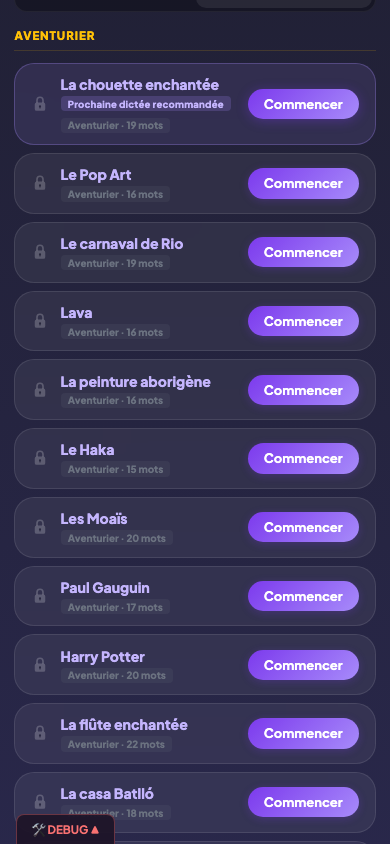
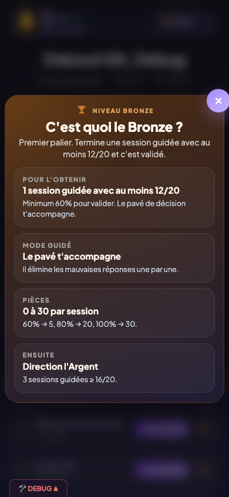
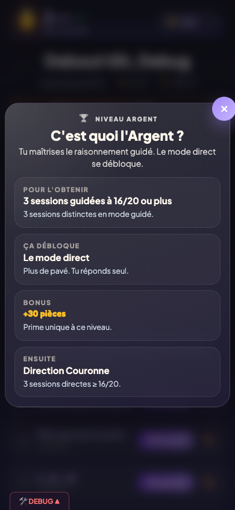
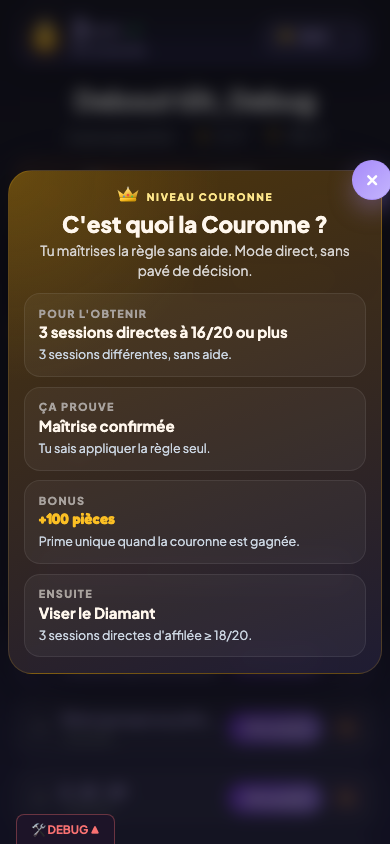
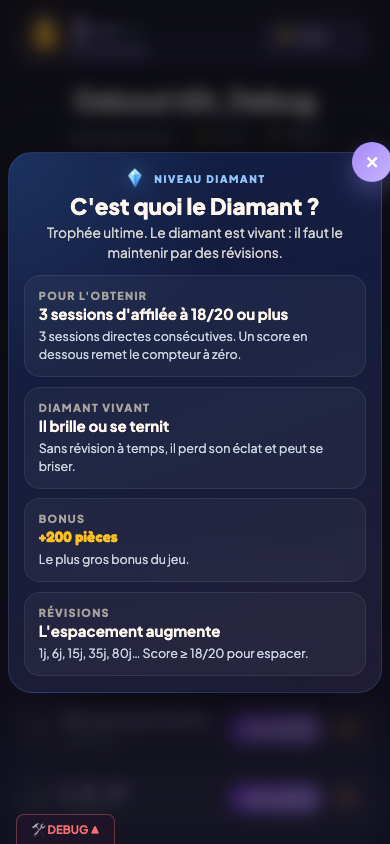
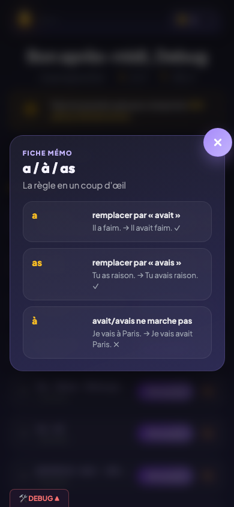

# Règles de grammaire

## Description

PrimoLingo propose un catalogue de 20 règles de grammaire et d'orthographe (a/à, leur/leurs, ce/se, ces/ses, son/sont, ou/où, etc.). Chaque règle progresse indépendamment à travers quatre niveaux visibles : Bronze, Argent, Couronne et Diamant. A chaque niveau, l'enfant doit prouver sa maitrise par des sessions de quiz successives. Une fiche mémo accompagne chaque règle pour rappeler l'essentiel avant de jouer.

## Parcours utilisateur

### 1. La liste des règles

Depuis le dashboard, l'enfant voit toutes les règles organisées en trois sections : les révisions dues, les règles en cours et les règles à découvrir. Chaque carte de règle affiche son nom, son niveau actuel (badge coloré) et un indicateur de progression vers le niveau suivant.

### 2. Les quatre niveaux

Chaque règle suit la même progression :

| Niveau | Comment l'atteindre | Récompense |
|--------|---------------------|------------|
| **Bronze** | Terminer 1 session de quiz guidé avec au moins 60 % | — |
| **Argent** | Réussir 3 sessions de quiz guidé avec au moins 80 % | +30 pièces, débloque le quiz direct |
| **Couronne** | Réussir 3 sessions de quiz direct avec au moins 80 % | +100 pièces |
| **Diamant** | Réussir 3 sessions de quiz direct d'affilée à 18/20 ou plus | +200 pièces, active les révisions espacées |

Sur 20 questions, 80 % correspond à 16 bonnes réponses et 90 % à 18 bonnes réponses.

Pour le Diamant, le compteur de sessions consécutives repart à zéro dès qu'une session passe en dessous de 90 %. C'est volontairement exigeant : le Diamant est un vrai trophée.

### 3. Les popups de niveau

Chaque badge de niveau est cliquable et ouvre une popup d'information. Il y a quatre popups de niveau principal :

   

### 5. La fiche mémo

Avant de lancer un quiz, l'enfant peut consulter la fiche mémo de la règle. Cette fiche résume en quelques lignes le principe de la règle, avec des exemples clairs. Elle reste accessible à tout moment depuis la carte de la règle.

### 6. Choisir une règle et lancer un quiz

L'enfant appuie sur une règle pour voir les options disponibles :
- Si la règle est au niveau Bronze ou n'a pas encore été commencée, seul le **quiz guidé** est proposé.
- A partir du niveau Argent, le **quiz direct** est également accessible.
- Si une révision est due (niveau Diamant), un bouton de révision apparait en priorité.

## Règles

| ID | Règle | Critère de succès |
|----|-------|-------------------|
| N04 | Chaque règle progresse indépendamment à travers les niveaux Bronze, Argent, Couronne, Diamant | Le niveau d'une règle ne dépend que des sessions jouées sur cette règle |
| N05 | Les seuils de passage de niveau sont respectés (1 session ≥ 60 % pour Bronze, 3 à 80 % pour Argent, 3 à 80 % pour Couronne, 3 consécutives à 90 % pour Diamant) | Le passage de niveau se déclenche exactement au nombre de sessions requis avec le score requis |

## Voir aussi

- [Quiz guidé](06-quiz-guide.md) — Le mode d'apprentissage avec aide pas à pas
- [Quiz direct](07-quiz-direct.md) — Le mode maitrise sans aide
- [Diamant et révisions](08-diamant-revisions.md) — Ce qui se passe après le Diamant
- [Dashboard enfant](03-dashboard-enfant.md) — Affichage des règles sur l'écran d'accueil
