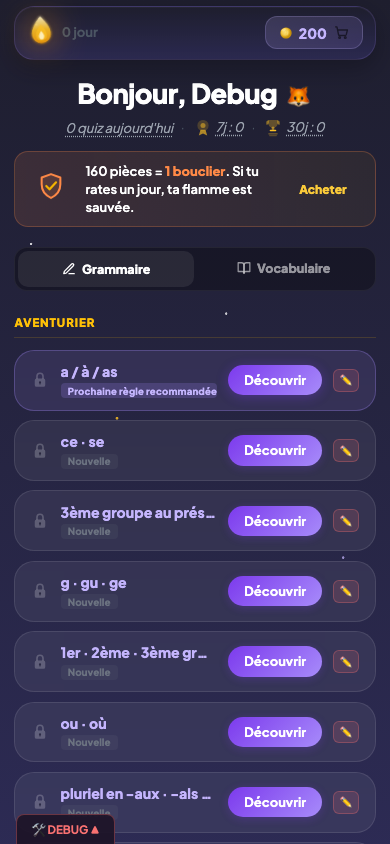

# Quiz guidé

## Description

Le quiz guidé est le mode d'apprentissage principal de PrimoLingo. L'enfant répond à une série de questions sur une règle de grammaire, mais il n'est pas livré à lui-même : un pavé de décision l'aide à raisonner étape par étape avant de choisir la bonne réponse. Le personnage compagnon l'accompagne pendant toute la session et réagit à chaque réponse.

## Parcours utilisateur

### 1. Lancement du quiz

L'enfant sélectionne une règle sur le dashboard et lance le quiz guidé. La première question apparait avec la phrase à compléter, les choix de réponse et le pavé de décision.

### 2. Le pavé de décision

Avant de choisir la réponse finale, l'enfant doit répondre à une ou deux questions intermédiaires. Ces questions l'aident à raisonner :

- Par exemple, pour la règle "leur / leurs" : "Le mot qui suit est-il un verbe ou un nom ?" puis "Le nom est-il au singulier ou au pluriel ?"
- A chaque bonne réponse sur un axe de décision, les choix incorrects sont éliminés visuellement.
- L'enfant finit par choisir la réponse finale parmi les options restantes.

Ce raisonnement guidé apprend à l'enfant la logique derrière la règle, plutôt que de deviner au hasard.

### 3. Le retour après chaque réponse

Après chaque question, l'enfant reçoit un retour immédiat :

- **Bonne réponse** : un effet visuel positif, le personnage applaudit (s'il possède cette émotion). Le score progresse.
- **Mauvaise réponse** : la bonne réponse est montrée avec une courte explication. Le personnage réagit avec une expression de surprise ou de réflexion.

### 4. Le personnage pendant le quiz

Le personnage compagnon est visible dans la barre de progression en haut de l'écran. Il change d'expression à chaque événement :

- Au début de la session, il fait un geste de salut.
- A chaque bonne réponse, il applaudit.
- A chaque erreur, il prend un air surpris ou pensif.
- Si le score final est excellent (90 % ou plus), il danse ou célèbre la victoire.

Si l'enfant ne possède pas encore l'émotion déclenchée, le personnage reste neutre avec une bulle verrouillée qui invite à débloquer l'émotion en boutique.

### 5. La barre de progression

En haut de l'écran, une barre indique le nombre de questions répondues sur le total de la session. L'enfant sait toujours où il en est.

### 6. Fin de la session

Après la dernière question, l'enfant est dirigé vers l'écran de fin de session qui affiche le score, les pièces gagnées et la progression.

## Règles

| ID | Règle | Critère de succès |
|----|-------|-------------------|
| S04 | Le quiz guidé présente un pavé de décision avant la réponse finale | Chaque question affiche au moins un axe de décision intermédiaire avant les choix finaux |
| S05 | Chaque bonne réponse sur un axe élimine visuellement les choix incorrects | Les options éliminées disparaissent ou sont grisées après une réponse correcte sur l'axe |
| S06 | Un retour est affiché après chaque question (bonne ou mauvaise réponse) | La bonne réponse et une explication courte sont toujours visibles avant de passer à la question suivante |
| E03 | Le personnage est visible dans la barre de progression du quiz | Le personnage compagnon apparait en haut de l'écran pendant toute la session |
| E04 | Le personnage change d'expression selon les événements du quiz | Le personnage réagit différemment aux bonnes réponses, mauvaises réponses et au score final |
| E05 | Si une émotion n'est pas débloquée, une bulle verrouillée s'affiche avec une invitation à l'acheter | Le personnage reste en position neutre et une bulle cliquable propose le déblocage pour 200 pièces |

## Voir aussi

- [Règles de grammaire](05-regles-grammaire.md) — Le catalogue des règles et les niveaux
- [Quiz direct](07-quiz-direct.md) — Le mode sans aide, débloqué au niveau Argent
- [Écran de fin de session](09-ecran-fin-session.md) — Score, pièces et progression après le quiz
- [Personnages](12-personnages.md) — Détail des personnages et des émotions
