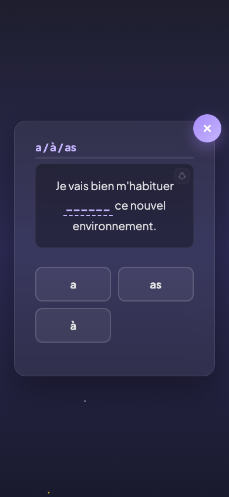

# Quiz direct

## Description

Le quiz direct est le mode maitrise de PrimoLingo. Il se débloque une fois la règle au niveau Argent. L'enfant répond aux mêmes questions que dans le quiz guidé, mais sans pavé de décision ni aide intermédiaire. Il doit choisir directement la bonne réponse parmi tous les choix proposés. C'est ici que l'enfant prouve qu'il a assimilé la règle.

## Parcours utilisateur

### 1. Déblocage du quiz direct

Le quiz direct devient accessible dès que la règle atteint le niveau Argent (3 sessions de quiz guidé réussies à 80 % ou plus). Sur la carte de la règle dans le dashboard, un nouveau bouton "Quiz direct" apparait à coté du quiz guidé.

### 2. Déroulement de la session

La session se déroule comme le quiz guidé, mais en version simplifiée :

- La phrase à compléter est affichée.
- Tous les choix de réponse sont visibles immédiatement.
- Pas de question intermédiaire, pas d'élimination progressive.
- L'enfant choisit directement sa réponse.

Le retour après chaque question reste identique : la bonne réponse est indiquée en cas d'erreur, avec une courte explication.

### 3. Progression vers la Couronne et le Diamant

Le quiz direct est le seul mode qui permet de progresser au-delà du niveau Argent :

- **Vers la Couronne** : réussir 3 sessions de quiz direct à 80 % ou plus.
- **Vers le Diamant** : réussir 3 sessions de quiz direct **consécutives** à 90 % ou plus.

Le personnage accompagne l'enfant de la même manière que dans le quiz guidé.

### 4. Fin de session

Après la dernière question, l'écran de fin de session s'affiche avec le score, les pièces gagnées et l'avancement vers le niveau suivant.

## Règles

| ID | Règle | Critère de succès |
|----|-------|-------------------|
| S07 | Le quiz direct est débloqué uniquement au niveau Argent ou supérieur | Le bouton "Quiz direct" n'apparait pas tant que la règle n'a pas atteint le niveau Argent |

## Voir aussi

- [Quiz guidé](06-quiz-guide.md) — Le mode d'apprentissage avec aide pas à pas
- [Règles de grammaire](05-regles-grammaire.md) — Les niveaux et conditions de progression
- [Diamant et révisions](08-diamant-revisions.md) — Ce qui se passe après le Diamant
- [Écran de fin de session](09-ecran-fin-session.md) — Score, pièces et progression après le quiz
