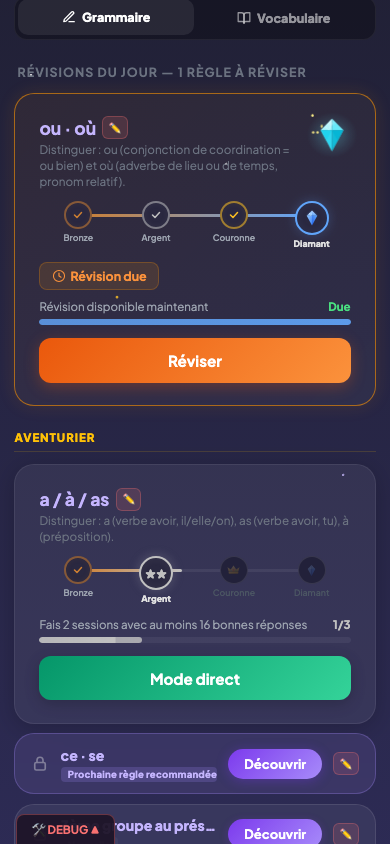

# Diamant et révisions

## Description

Le Diamant est le niveau ultime d'une règle de grammaire dans PrimoLingo. L'obtenir est un exploit (3 sessions consécutives à 90 % en quiz direct), mais le conserver est un engagement sur la durée. Une fois le Diamant atteint, la règle entre dans un cycle de révisions espacées : des sessions de rappel programmées à intervalles croissants pour ancrer la connaissance dans la mémoire à long terme. Si l'enfant ne révise pas à temps, le Diamant perd de sa santé et peut finir par se briser.

## Parcours utilisateur

### 1. Obtenir le Diamant

Quand l'enfant réussit sa troisième session consécutive à 90 % ou plus en quiz direct, le Diamant est décerné. Une animation de célébration s'affiche et l'enfant reçoit 200 pièces.


### 2. Les révisions espacées

Le lendemain de l'obtention du Diamant, la première révision est programmée. La règle apparait en haut du dashboard dans la section "Révisions" avec un indicateur visuel signalant qu'une révision est due.

L'enfant lance la révision comme un quiz direct classique. Selon le score obtenu, l'intervalle avant la prochaine révision change :

| Score de la révision | Effet sur le Diamant |
|----------------------|----------------------|
| 90 % ou plus | Le Diamant brille : la prochaine révision est repoussée plus loin (1 jour, puis 6, puis 15, puis 35, puis 80 jours...) |
| Entre 80 % et 89 % | Le Diamant tient mais reste fragile : l'intervalle ne change pas |
| Moins de 80 % | Le Diamant souffre : l'intervalle revient à 1 jour et la santé du Diamant diminue |

### 3. La santé du Diamant

Chaque Diamant possède un indicateur de santé. La santé est pleine à l'obtention et diminue dans deux cas :
- Une révision ratée (score sous 80 %).
- Une révision non faite : chaque jour de retard après la date prévue réduit la santé progressivement.



### 4. La degradation

Si l'enfant ne lance pas sa revision a temps, la sante du Diamant baisse lineairement au fil des jours. Le calcul est :

```
sante = max(0, 1 - (jours_de_retard / delai_de_grace))
```

Le **delai de grace** est egal au maximum entre 7 jours et l'intervalle SM-2 actuel de la regle. Ainsi :
- Un diamant fraichement obtenu (intervalle 1 jour) a un delai de grace de 7 jours.
- Un diamant revise depuis longtemps (intervalle 35 jours) a 35 jours de grace.

**Impact visuel selon la sante** :

| Sante | Etat | Apparence |
|-------|------|-----------|
| >= 80% | Sain | Cyan vif (#67e8f9), halo lumineux pulse, 6 particules dorees en orbite |
| 50-79% | Fatigue | Bleu-gris (#94a3b8), reflets attenues, leger voile blanc pulsant |
| 20-49% | Fissure | Gris-bleu (#64748b), 1 a 3 fissures apparaissent avec animation |
| < 20% | Critique | Gris (#475569), ombre rouge, tremblement (jitter +-1px), 3 fissures rouges |

### 5. Le bris du Diamant

Quand la santé atteint zéro, le Diamant se brise. La règle redescend au niveau Couronne. L'enfant devra refaire 3 sessions consécutives à 90 % en quiz direct pour retrouver son Diamant. L'écran de retour après absence montre chaque Diamant impacté un par un.

## Règles

| ID | Règle | Critère de succès |
|----|-------|-------------------|
| N06 | Le Diamant est obtenu après 3 sessions consécutives de quiz direct à 90 % ou plus | Le passage au niveau Diamant se déclenche exactement à la 3e session consécutive qualifiante |
| N07 | Une révision est programmée dès le lendemain de l'obtention du Diamant | La règle apparait dans la section Révisions du dashboard le jour suivant |
| N08 | Le Diamant se brise quand sa santé tombe à zéro et la règle redescend au niveau Couronne | Après bris, le badge de la règle passe de Diamant à Couronne et le compteur de sessions consécutives repart à zéro |

## Voir aussi

- [Règles de grammaire](05-regles-grammaire.md) — Les quatre niveaux de progression
- [Quiz direct](07-quiz-direct.md) — Le mode utilisé pour les révisions
- [Flamme et série](04-flamme-serie.md) — Impact de l'absence sur la flamme et les diamants
- [Dashboard enfant](03-dashboard-enfant.md) — La section Révisions sur l'écran d'accueil
