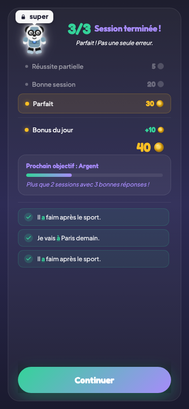
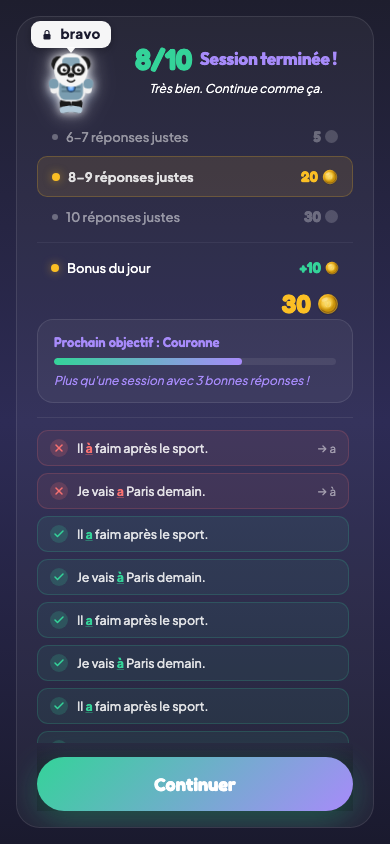
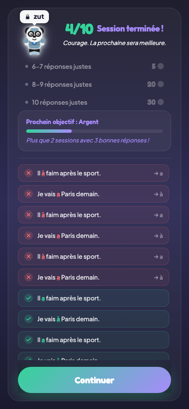

# Écran de fin de session

## Description

A la fin de chaque session de quiz (guidé ou direct), un écran récapitulatif s'affiche. L'enfant y découvre son score, les pièces gagnées (avec les éventuels bonus), sa progression vers le prochain niveau de la règle, et un récapitulatif question par question de ses réponses.

## Parcours utilisateur

### 1. Affichage du score

Le score s'affiche en grand au centre de l'écran, sous forme de pourcentage et de nombre de bonnes réponses sur le total (par exemple : 17/20, soit 85 %). Le personnage compagnon réagit selon le résultat : il célèbre pour un excellent score, applaudit pour un bon score, ou prend un air pensif pour un score faible.

### 2. Les pièces gagnées

Sous le score, le détail des pièces est affiché :

| Score obtenu | Pièces de base |
|--------------|----------------|
| 100 % | 30 pièces |
| Entre 80 % et 99 % | 20 pièces |
| Entre 60 % et 79 % | 5 pièces |
| Moins de 60 % | 0 pièce |

### 3. Les bonus

Plusieurs bonus peuvent s'ajouter aux pièces de base. Chaque bonus est affiché séparément avec une animation :

- **Bonus du jour** : +10 pièces pour la première session qualifiante de la journée (score ≥ 60 %).
- **Bonus de bienvenue** : +200 pièces pour la toute première session qualifiante de la vie du joueur. Ce bonus n'est versé qu'une seule fois.
- **Bonus de palier de flamme** : les pièces du palier atteint (100, 200, 350, 500 ou 1 000 selon le palier).
- **Bonus double pièces** : si l'enfant a activé le boost "double pièces" en boutique, toutes les pièces de la session sont doublées.

### 4. La barre de progression

Une barre de progression montre l'avancement de la règle vers le prochain niveau :

- De rien vers le Bronze : nombre de sessions guidées complétées.
- Du Bronze vers l'Argent : nombre de sessions guidées réussies à 80 % sur les 3 nécessaires.
- De l'Argent vers la Couronne : nombre de sessions directes réussies à 80 % sur les 3 nécessaires.
- De la Couronne vers le Diamant : nombre de sessions directes consécutives réussies à 90 % sur les 3 nécessaires.

Si un changement de niveau a lieu, une animation de célébration s'affiche avec le nouveau badge et les pièces bonus du niveau.

### 5. Le récapitulatif des réponses

En bas de l'écran, un récapitulatif liste chaque question de la session avec la réponse donnée par l'enfant et la bonne réponse. Les erreurs sont mises en évidence pour que l'enfant puisse revoir les points difficiles.

### 6. Retour au dashboard

Un bouton permet de revenir au dashboard. Les compteurs (pièces, flamme, niveau de la règle) sont déjà mis à jour.

## Règles

| ID | Règle | Critère de succès |
|----|-------|-------------------|
| N01 | Le score est affiché en pourcentage et en nombre de bonnes réponses | L'écran montre à la fois "85 %" et "17/20" (ou équivalent) |
| N02 | Les pièces de base correspondent au barème (30/20/5/0 selon le score) | Le nombre de pièces affiché correspond exactement au palier du score obtenu |
| N03 | Les bonus (bienvenue, du jour, palier, double) sont affichés séparément | Chaque bonus applicable apparait sur sa propre ligne avec son montant |
| N24 | Le bonus du jour (+10 pièces) n'est versé qu'une fois par jour | Si l'enfant fait plusieurs sessions dans la même journée, seule la première session qualifiante déclenche le bonus |
| N25 | Le bonus de bienvenue (+200 pièces) n'est versé qu'une seule fois dans la vie du joueur | Le bonus n'apparait qu'à la toute première session qualifiante et jamais ensuite |
| E06 | La barre de progression vers le niveau suivant est visible sur l'écran de fin | La barre indique le nombre de sessions qualifiantes sur le total requis pour le prochain niveau |

## Voir aussi

- [Quiz guidé](06-quiz-guide.md) — Le mode d'apprentissage qui précède cet écran
- [Quiz direct](07-quiz-direct.md) — Le mode maitrise qui précède cet écran
- [Règles de grammaire](05-regles-grammaire.md) — Les seuils de passage de niveau
- [Flamme et série](04-flamme-serie.md) — Les bonus de palier de flamme
- [Économie et récompenses](14-economie-recompenses.md) — Vue d'ensemble de l'économie en pièces
