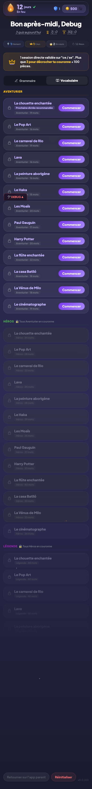
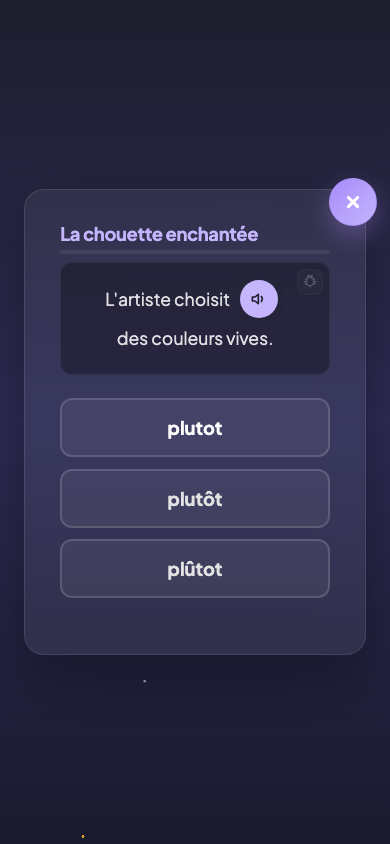

# Dictée

## Description

La dictée est le second pilier de PrimoLingo, accessible depuis un onglet dédié sur le dashboard. L'enfant écoute un passage audio (tiré de thèmes variés : Harry Potter, Pop Art, Carnaval de Rio, Gauguin, Vénus de Milo...) puis le reconstruit ou le complète en tapant les mots. Les dictées sont organisées en trois niveaux progressifs : Aventurier, Héros et Légende. Chaque niveau se débloque en terminant le précédent.

## Parcours utilisateur

### 1. L'onglet Dictée

Depuis le dashboard, l'enfant bascule vers l'onglet Dictée. Il y trouve la liste de toutes les sessions de dictée organisées par niveau, avec un badge coloré pour chaque niveau :

- **Aventurier** (jaune) : accessible dès le départ.
- **Héros** (vert) : verrouillé tant que toutes les sessions Aventurier n'ont pas atteint le niveau Couronne.
- **Légende** (violet) : verrouillé tant que toutes les sessions Héros n'ont pas atteint le niveau Couronne.

Chaque session affiche son thème, son niveau de progression actuel et un badge visuel.

### 2. Lancement d'une dictée

L'enfant choisit une session de dictée et la lance. Le passage audio se joue automatiquement. L'enfant peut réécouter le passage autant de fois que nécessaire.

### 3. Le déroulement

Selon le mode de la dictée, l'enfant :

- **Reconstruit** le passage : il tape les mots entendus dans l'ordre, guidé par des emplacements vides.
- **Complète** le passage : le texte est affiché avec des trous à remplir, l'enfant saisit les mots manquants.

Le guidage aide l'enfant à se concentrer sur les mots clés et les difficultés orthographiques du passage.

### 4. Score et progression

Comme pour les quiz de grammaire, la dictée suit le même système de niveaux (Bronze, Argent, Couronne, Diamant) et les mêmes barèmes de pièces. L'écran de fin de session affiche le score, les pièces gagnées et la progression vers le niveau suivant.

### 5. Déblocage des niveaux supérieurs

Quand l'enfant a amené toutes les sessions Aventurier au niveau Couronne, le niveau Héros se déverrouille. Les sessions Héros sont plus longues et portent sur des textes plus complexes. Le même principe s'applique pour passer de Héros à Légende.

## Règles

| ID | Règle | Critère de succès |
|----|-------|-------------------|
| D01 | Les sessions Aventurier sont accessibles dès le départ | L'enfant peut lancer n'importe quelle session Aventurier sans condition préalable |
| D02 | Les sessions Héros sont verrouillées tant que toutes les sessions Aventurier ne sont pas au niveau Couronne | Le cadenas disparait uniquement quand la dernière session Aventurier atteint le niveau Couronne |
| D03 | Les sessions Légende sont verrouillées tant que toutes les sessions Héros ne sont pas au niveau Couronne | Le cadenas disparait uniquement quand la dernière session Héros atteint le niveau Couronne |
| D04 | L'enfant peut réécouter le passage audio autant de fois que nécessaire | Le bouton de réécoute reste actif pendant toute la durée de la session |
| D05 | Le système de niveaux (Bronze, Argent, Couronne, Diamant) s'applique aux dictées | La progression par session suit les mêmes seuils que les quiz de grammaire |
| D06 | Le barème de pièces est identique à celui des quiz de grammaire | Les pièces gagnées en dictée correspondent au même barème (30/20/5/0 selon le score) |
| N23 | Chaque session de dictée est associée à un thème culturel | Le nom du thème (Harry Potter, Pop Art, etc.) est affiché sur la carte de la session |
| N23b | Les sessions de dictée utilisent un passage audio comme support | Chaque session démarre par la lecture d'un passage audio avant la saisie |

## Voir aussi

- [Dashboard enfant](03-dashboard-enfant.md) — L'onglet Dictée sur le dashboard
- [Règles de grammaire](05-regles-grammaire.md) — Le système de niveaux commun
- [Écran de fin de session](09-ecran-fin-session.md) — Score et pièces après une dictée
- [Économie et récompenses](14-economie-recompenses.md) — Barème des pièces
