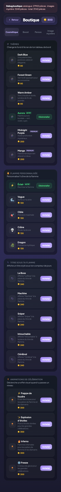
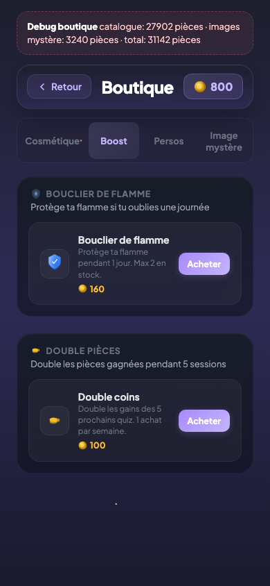

# Boutique

## Description

La boutique permet à l'enfant de dépenser ses pièces dans deux grandes catégories : les cosmétiques, qui modifient l'apparence du jeu, et les boosts, qui offrent un avantage temporaire. Chaque achat est définitif et le solde est débité immédiatement.

## Parcours utilisateur

L'enfant accède à la boutique depuis le dashboard. Deux onglets organisent les achats.

### Onglet Cosmétique

L'enfant parcourt les articles permanents qui changent l'apparence de son jeu :

- **Thèmes de couleur** — modifient la palette du dashboard. Certains sont basiques (80 pièces), d'autres premium (320 ou 360 pièces).
- **Flammes** — remplacent l'icône de la flamme par un visuel alternatif (éclair, vague, cible, crâne, dragon) pour 130 pièces.
- **Titres** — affichent un surnom sous le compteur de jours (Le Boss, Machine, Sniper, Intouchable, Cérébral) pour 240 pièces.
- **Animations de victoire** — déclenchent un effet visuel à chaque bonne réponse (Glow Neon, Effet Glitch, Onde de choc, Confettis sobres) pour 190 pièces.
- **Animations de célébration** — jouent un effet plein écran lors d'un palier (Frappe de foudre, Explosion d'étoiles, Inferno, Freeze) pour 300 pièces.

### Onglet Boost

L'enfant achète des consommables à effet temporaire :

- **Bouclier de flamme** (160 pièces) — protège la flamme pendant 1 jour d'absence. L'enfant peut en posséder 2 au maximum.
- **Double pièces** (100 pièces) — double les pièces gagnées pendant les 5 prochaines sessions. Limité à 1 achat par semaine (le compteur recommence chaque lundi).

Quand l'enfant sélectionne un article, une popup de confirmation lui montre le prix et son solde. S'il confirme, les pièces sont débitées et l'article est immédiatement actif.

## Règles

| ID | Règle | Critère de succès |
|----|-------|-------------------|
| S01 | L'achat déduit les pièces | Le solde diminue du prix exact après confirmation d'achat |
| N16 | Le double pièces dure 5 sessions | Le compteur de sessions bonus décrémente à chaque session jouée |
| N17 | Le double pièces est verrouillé 1 semaine | Un deuxième achat la même semaine est bloqué jusqu'au lundi suivant |

## Voir aussi

- [Économie et récompenses](./14-economie-recompenses.md)
- [Personnages](./12-personnages.md)
- [Images mystère](./13-images-mystere.md)
- [Flamme et série](./04-flamme-serie.md)
