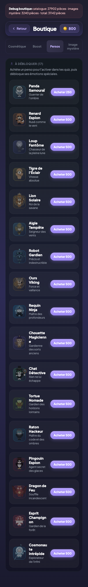
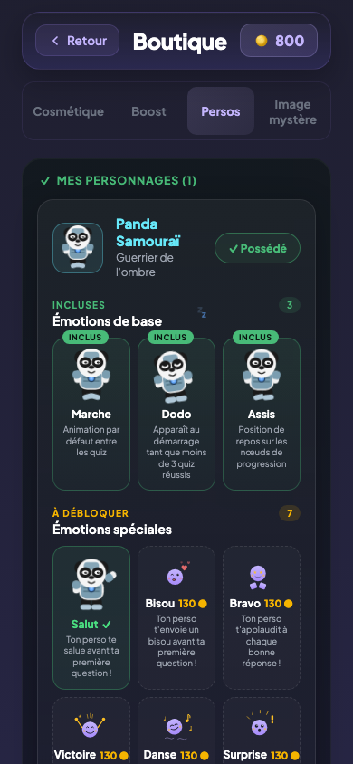

# Personnages

## Description

L'enfant peut adopter des personnages compagnons qui l'accompagnent partout dans le jeu : sur le dashboard, pendant les quiz et sur l'ecran de fin de session. Chaque personnage possede 10 emotions differentes qui reagissent a ce qui se passe dans la partie. Les personnages sont au coeur de l'experience — ils ne sont pas decoratifs, ils vivent avec le joueur.

## Parcours utilisateur

### Decouvrir le catalogue

Depuis la boutique, l'enfant ouvre l'onglet des personnages. Il y decouvre la liste des compagnons disponibles. Le premier personnage (le Panda Samourai, a 250 pieces) est accessible rapidement grace au bonus de bienvenue. Les 14 autres coutent 500 pieces chacun et representent un objectif de moyen terme.

Les personnages non achetes affichent leur emoji (🐼, 🦊, 🐺…) à la place du sprite. Une fois achete, le personnage affiche "Possede" a la place du prix et son sprite animé est débloqué.

### Les emotions

Chaque personnage dispose de 10 emotions au total :

**3 emotions de base** (offertes avec l'achat du personnage) :
- Marche — animation par defaut entre les quiz
- Dodo — le personnage dort au demarrage tant qu'aucun quiz n'a encore ete complete (0 session). Des la premiere session terminee, il passe en mode Marche.
- Assis — position de repos

**7 emotions de boutique** (130 pieces chacune, a debloquer une par une) :
- Coucou — salut avant la premiere question
- Bisou — variante du salut
- Applaudissement — a chaque bonne reponse
- Victoire — en fin de session avec un excellent score
- Danse — variante de la victoire
- Surprise — apres une mauvaise reponse
- Reflexion — variante de la surprise

### Equiper un personnage

L'enfant choisit quel personnage l'accompagne. Si plusieurs personnages sont achetes, le jeu en assigne un different a chaque regle pour la journee, de facon stable (le meme personnage revient pour la meme regle le meme jour).

### Apparition pendant le quiz

Le personnage est visible au-dessus de la barre de progression pendant tout le quiz. Il reagit en direct :
- Demarrage (0 session completee) : il est en mode Dodo — il dort jusqu'a la fin du premier quiz
- Premiere question : il fait coucou ou envoie un bisou
- Bonne reponse : il applaudit
- Mauvaise reponse : il est surpris ou reflechit
- Score final eleve : il danse ou celebre la victoire

Si l'enfant n'a pas encore achete l'emotion correspondante, le personnage retombe sur l'animation de marche et une bulle verrouillee s'affiche pour proposer l'achat.

## Regles

| ID | Regle | Critere de succes |
|----|-------|-------------------|
| S02 | Un personnage achete est marque "Possede" | La carte affiche "Possede" a la place du prix apres achat |
| S03 | On peut equiper une emotion | Apres achat de l'emotion, elle est selectionnable et le personnage l'adopte |
| K01 | Les personnages sont tous visibles dans la boutique | Tous les noms de personnages disponibles apparaissent dans la liste |
| K02 | Les anciens personnages ont ete retires | Les personnages deprecies n'apparaissent plus dans la boutique |
| K03 | 10 emotions par personnage | Marche, dodo, assis, coucou, bisou, applaudissement, victoire, danse, surprise et reflexion |
| K04 | Les sprites s'affichent correctement | Chaque personnage se charge sans erreur visuelle |
| N12d | Si une emotion n'est pas possedee, le personnage marche | Le personnage retombe sur l'animation de marche par defaut |

## Voir aussi

- [Boutique](./11-boutique.md)
- [Quiz guide](./06-quiz-guide.md)
- [Quiz direct](./07-quiz-direct.md)
- [Ecran de fin de session](./09-ecran-fin-session.md)
