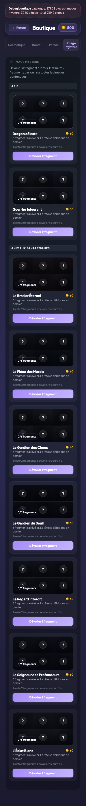

# Images mystère

## Description

L'enfant peut collectionner des images cachées en achetant leurs fragments un par un. Chaque image est composée de 6 tuiles qui se révèlent progressivement. Le suspense est maintenu jusqu'au dernier morceau, et l'enfant ne peut acheter que 2 fragments par jour pour étaler le plaisir de la découverte.

## Parcours utilisateur

### Découvrir la collection

Depuis la boutique, l'enfant accède à la section des images mystère. Il y voit les images disponibles, chacune représentée par une grille de 6 cases. Les cases déjà révélées montrent un fragment de l'illustration ; les autres restent cachées.

### Acheter un fragment

Chaque fragment coûte 60 pièces. L'enfant clique sur l'image de son choix et un nouveau morceau se révèle. L'ordre de révélation est aléatoire, sauf le dernier fragment qui est fixé par l'image — c'est toujours le même morceau qui se dévoile en dernier pour maximiser l'effet de surprise.

### Limite quotidienne

L'enfant peut acheter au maximum 2 fragments par jour, toutes images confondues. Même s'il a assez de pièces, le troisième achat de la journée est refusé. Cette limite permet d'étaler la découverte sur plusieurs jours et incite l'enfant à revenir.

### Images personnalisées

Les parents peuvent ajouter leurs propres images (photos de famille, dessins) depuis le tableau de bord parent. Ces images apparaissent ensuite dans la collection de l'enfant et se révèlent de la même façon.

## Règles

| ID | Règle | Critère de succès |
|----|-------|-------------------|
| N18 | Maximum 2 morceaux par jour | Le 3e achat de la journée est refusé même si les pièces suffisent |
| N19 | Révélation progressive en 6 tuiles | Les tuiles se révèlent dans l'ordre ; la dernière n'est jamais en premier |

## Voir aussi

- [Boutique](./11-boutique.md)
- [Économie et récompenses](./14-economie-recompenses.md)
- [Tableau de bord parent](./16-tableau-bord-parent.md)
