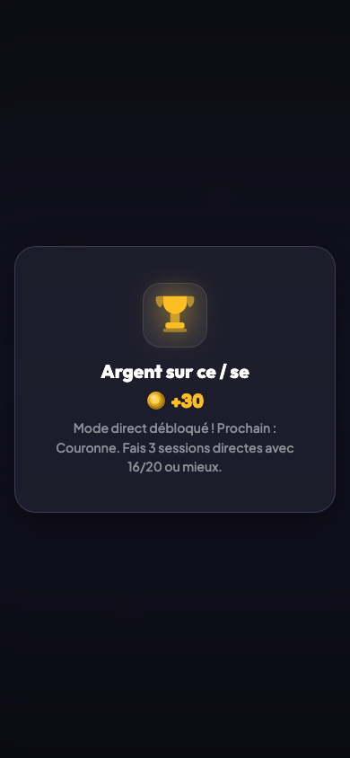

# Economie et recompenses

## Description

Les pieces sont la monnaie unique du jeu. L'enfant les gagne en jouant des quiz et grace a differents bonus. Elles servent a acheter des cosmetiques, des personnages, des emotions et des boosts dans la boutique. Des popups de recompense celebrent les accomplissements importants pour motiver l'enfant a chaque etape.

## Parcours utilisateur

### Gagner des pieces en jouant

A la fin de chaque quiz, l'enfant recoit des pieces selon son score :

| Score | Pieces gagnees |
|-------|---------------|
| 100 % | 30 pieces |
| 80–99 % | 20 pieces |
| 60–79 % | 5 pieces |
| Moins de 60 % | 0 piece (la flamme ne progresse pas non plus) |

### Bonus de bienvenue

La toute premiere session reussie (au moins 60 %) rapporte un bonus exceptionnel de **200 pieces**. Ce bonus n'est verse qu'une seule fois dans la vie du joueur. Combine avec les pieces de la session, l'enfant peut atteindre 230 pieces des sa premiere partie — de quoi envisager son premier personnage en quelques jours.

### Bonus du jour

Chaque jour, la premiere session reussie (au moins 60 %) rapporte **10 pieces supplementaires**. Ce bonus se renouvelle tous les jours.

### Recompenses de palier de flamme

Les series de jours consecutifs sont recompensees par des bonus de pieces :

| Palier | Pieces bonus |
|--------|-------------|
| 7 jours | 100 pieces |
| 14 jours | 200 pieces |
| 30 jours | 350 pieces |
| 60 jours | 500 pieces |
| 100 jours | 1 000 pieces |

### Recompenses de montee de niveau

Chaque fois qu'une regle passe a un nouveau niveau, l'enfant est recompense :

- **Argent** : +30 pieces (et le mode direct est debloque)
- **Couronne** : +100 pieces
- **Diamant** : +200 pieces

### Popups de celebration

Les moments forts declenchent des popups animees pour feliciter l'enfant :

Ces popups apparaissent a la fin du quiz, avant le retour au dashboard. Elles sont dedupliquees : si plusieurs evenements arrivent en meme temps (par exemple une montee de niveau et le deblocage du mode direct), ils sont fusionnes en une seule annonce.

## Regles

| ID | Regle | Critere de succes |
|----|-------|-------------------|
| N01 | Les pieces suivent le bareme | 0 % donne 0, 60-79 % donne 5, 80-99 % donne 20, 100 % donne 30 |
| N02 | Le bonus de bienvenue est unique | 200 pieces a la premiere session reussie, jamais apres |
| N03 | Le bonus du jour est quotidien | +10 pieces pour la premiere session reussie du jour |
| N11 | Les paliers de flamme donnent les bonnes recompenses | 7j/100, 14j/200, 30j/350, 60j/500, 100j/1000 |

## Voir aussi

- [Ecran de fin de session](./09-ecran-fin-session.md)
- [Flamme et serie](./04-flamme-serie.md)
- [Boutique](./11-boutique.md)
- [Personnages](./12-personnages.md)
