# Coaching et messages

## Description

Un bandeau de motivation s'affiche sur le dashboard enfant avec un message personnalisé. Le message dépend de la situation du joueur : nouveau, en progression, flamme en danger, proche d'un palier, etc. Chaque message a une priorité, et un seul s'affiche à la fois.

## Galerie des icones SVG du bandeau

Chaque message de coaching utilise une icone SVG adaptee au contexte. Les icones sont definies dans `MotivationBanner.jsx` via le composant `BannerSvgIcon`. Les couleurs (`accent`, `secondary`) varient selon le theme actif.

---

## Émotions chibi (boutique)

Les 7 émotions débloquables affichées dans la boutique (section "À DÉBLOQUER"). Icônes définies dans `ProductIcons.jsx`, données dans `src/data/shopCharacters.js`.

  

    <svg width="60" height="60" viewBox="0 0 96 96"><defs><linearGradient id="doc-wave" x1="0" y1="0" x2="0" y2="1"><stop offset="0" stop-color="#c4b5fd"/><stop offset="1" stop-color="#a78bfa"/></linearGradient></defs><circle cx="44" cy="54" r="22" fill="url(#doc-wave)"/><circle cx="36" cy="50" r="3" fill="#1e1e2e"/><circle cx="37.2" cy="48.8" r="1" fill="#fff"/><circle cx="52" cy="50" r="3" fill="#1e1e2e"/><circle cx="53.2" cy="48.8" r="1" fill="#fff"/><path d="M36 60 Q44 68 52 60" stroke="#1e1e2e" stroke-width="2.5" stroke-linecap="round" fill="none"/><circle cx="28" cy="58" r="3" fill="#fbbf24" opacity="0.55"/><circle cx="60" cy="58" r="3" fill="#fbbf24" opacity="0.55"/><path d="M64 46 L76 28" stroke="#fbbf24" stroke-width="3" stroke-linecap="round"/><circle cx="78" cy="25" r="4.5" fill="#fbbf24"/><path d="M84 18 Q88 23 84 28" stroke="#fbbf24" stroke-width="2" stroke-linecap="round" fill="none" opacity="0.7"/><path d="M88 14 Q93 20 88 26" stroke="#fbbf24" stroke-width="1.5" stroke-linecap="round" fill="none" opacity="0.4"/><path d="M24 60 L14 76" stroke="#fbbf24" stroke-width="2.5" stroke-linecap="round"/></svg>
    
Salut

    
130 pièces

  

  

    <svg width="60" height="60" viewBox="0 0 96 96"><defs><linearGradient id="doc-kiss" x1="0" y1="0" x2="0" y2="1"><stop offset="0" stop-color="#c4b5fd"/><stop offset="1" stop-color="#a78bfa"/></linearGradient></defs><circle cx="44" cy="54" r="22" fill="url(#doc-kiss)"/><path d="M33 48 Q36 44 39 48" stroke="#1e1e2e" stroke-width="2.5" stroke-linecap="round" fill="none"/><circle cx="52" cy="48" r="3" fill="#1e1e2e"/><circle cx="53.2" cy="46.8" r="1" fill="#fff"/><circle cx="28" cy="58" r="3" fill="#f87171" opacity="0.55"/><circle cx="60" cy="58" r="3" fill="#f87171" opacity="0.4"/><ellipse cx="41" cy="62" rx="4.5" ry="3.5" fill="#1e1e2e"/><ellipse cx="41" cy="62" rx="3" ry="2.2" fill="#f87171" opacity="0.7"/><path d="M70 24c-1-4-8-4-8 2 0 6 8 10 8 10s8-4 8-10c0-6-7-6-8-2z" fill="#f87171" opacity="0.9"/><path d="M82 12c-.5-2-4-2-4 1s4 5 4 5 4-2 4-5c0-3-3.5-3-4-1z" fill="#f87171" opacity="0.5"/><path d="M62 12c-.4-1.5-3-1.5-3 1s3 3.5 3 3.5 3-1 3-3.5c0-2.5-2.6-2.5-3-1z" fill="#f87171" opacity="0.35"/></svg>
    
Bisou

    
130 pièces

  

  

    <svg width="60" height="60" viewBox="0 0 96 96"><defs><linearGradient id="doc-clap" x1="0" y1="0" x2="0" y2="1"><stop offset="0" stop-color="#c4b5fd"/><stop offset="1" stop-color="#a78bfa"/></linearGradient></defs><circle cx="38" cy="44" r="22" fill="url(#doc-clap)"/><g transform="translate(30 41)"><path d="M0 -4.5 L1.2 -1.2 L4.5 -1 L1.5 1 L2.5 4.5 L0 2.5 L-2.5 4.5 L-1.5 1 L-4.5 -1 L-1.2 -1.2 Z" fill="#fbbf24"/></g><g transform="translate(46 41)"><path d="M0 -4.5 L1.2 -1.2 L4.5 -1 L1.5 1 L2.5 4.5 L0 2.5 L-2.5 4.5 L-1.5 1 L-4.5 -1 L-1.2 -1.2 Z" fill="#fbbf24"/></g><path d="M28 50 Q38 60 48 50 Q44 56 38 56 Q32 56 28 50 Z" fill="#1e1e2e"/><circle cx="22" cy="50" r="3" fill="#fbbf24" opacity="0.55"/><circle cx="54" cy="50" r="3" fill="#fbbf24" opacity="0.55"/><g transform="translate(26 78) rotate(-20)"><path d="M-7 -7 L5 -7 Q8 -7 8 -4 L8 6 Q8 9 5 9 L-7 9 Q-10 9 -10 6 L-10 -4 Q-10 -7 -7 -7 Z" fill="url(#doc-clap)"/></g><g transform="translate(50 78) rotate(20)"><path d="M-5 -7 L7 -7 Q10 -7 10 -4 L10 6 Q10 9 7 9 L-5 9 Q-8 9 -8 6 L-8 -4 Q-8 -7 -5 -7 Z" fill="url(#doc-clap)"/></g></svg>
    
Bravo

    
130 pièces

  

  

    <svg width="60" height="60" viewBox="0 0 96 96"><defs><linearGradient id="doc-vict" x1="0" y1="0" x2="0" y2="1"><stop offset="0" stop-color="#c4b5fd"/><stop offset="1" stop-color="#a78bfa"/></linearGradient></defs><circle cx="44" cy="58" r="22" fill="url(#doc-vict)"/><path d="M34 52 Q37 47 40 52" stroke="#1e1e2e" stroke-width="2.5" stroke-linecap="round" fill="none"/><path d="M48 52 Q51 47 54 52" stroke="#1e1e2e" stroke-width="2.5" stroke-linecap="round" fill="none"/><path d="M33 64 Q44 74 55 64" stroke="#1e1e2e" stroke-width="2.5" stroke-linecap="round" fill="none"/><circle cx="28" cy="62" r="3" fill="#fbbf24" opacity="0.55"/><circle cx="60" cy="62" r="3" fill="#fbbf24" opacity="0.55"/><path d="M22 52 L8 32" stroke="#fbbf24" stroke-width="3" stroke-linecap="round"/><circle cx="6" cy="29" r="4.5" fill="#fbbf24"/><path d="M66 52 L80 32" stroke="#fbbf24" stroke-width="3" stroke-linecap="round"/><circle cx="82" cy="29" r="4.5" fill="#fbbf24"/><path d="M38 26 L36 16" stroke="#fbbf24" stroke-width="2" stroke-linecap="round" opacity="0.7"/><path d="M44 24 L44 13" stroke="#fbbf24" stroke-width="2" stroke-linecap="round" opacity="0.55"/><path d="M50 26 L52 16" stroke="#fbbf24" stroke-width="2" stroke-linecap="round" opacity="0.7"/><path d="M16 16 L17.2 19.8 L21 20 L17.5 22.2 L18.5 26 L16 23.5 L13.5 26 L14.5 22.2 L11 20 L14.8 19.8Z" fill="#fbbf24" opacity="0.75"/></svg>
    
Victoire

    
130 pièces

  

  

    <svg width="60" height="60" viewBox="0 0 96 96"><defs><linearGradient id="doc-danse" x1="0" y1="0" x2="0" y2="1"><stop offset="0" stop-color="#c4b5fd"/><stop offset="1" stop-color="#a78bfa"/></linearGradient></defs><g transform="rotate(-15 42 50)"><circle cx="42" cy="50" r="22" fill="url(#doc-danse)"/><path d="M32 46 Q36 42 40 46" stroke="#1e1e2e" stroke-width="2.5" stroke-linecap="round" fill="none"/><path d="M44 46 Q48 42 52 46" stroke="#1e1e2e" stroke-width="2.5" stroke-linecap="round" fill="none"/><path d="M32 54 Q42 62 52 54" stroke="#1e1e2e" stroke-width="2.5" stroke-linecap="round" fill="none"/><circle cx="26" cy="54" r="3" fill="#fbbf24" opacity="0.55"/><circle cx="58" cy="54" r="3" fill="#fbbf24" opacity="0.55"/></g><g transform="translate(76 28)"><ellipse cx="0" cy="6" rx="5" ry="4" fill="#fbbf24" transform="rotate(-15)"/><rect x="3" y="-12" width="2.8" height="18" rx="0.5" fill="#fbbf24"/><path d="M5.8 -12 Q12 -10, 10 -3" stroke="#fbbf24" stroke-width="2.5" fill="none" stroke-linecap="round"/></g><g transform="translate(86 56) scale(0.65)"><ellipse cx="0" cy="6" rx="5" ry="4" fill="#fbbf24" transform="rotate(-15)" opacity="0.85"/><rect x="3" y="-12" width="2.8" height="18" rx="0.5" fill="#fbbf24" opacity="0.85"/></g><g transform="translate(14 28) scale(0.55)"><ellipse cx="0" cy="6" rx="5" ry="4" fill="#fbbf24" transform="rotate(-15)" opacity="0.7"/><rect x="3" y="-12" width="2.8" height="18" rx="0.5" fill="#fbbf24" opacity="0.7"/></g><path d="M16 82 Q22 78, 28 82 Q34 86, 40 82" stroke="#c4b5fd" stroke-width="2" fill="none" stroke-linecap="round" opacity="0.5"/><path d="M52 84 Q58 80, 64 84 Q70 88, 76 84" stroke="#c4b5fd" stroke-width="2" fill="none" stroke-linecap="round" opacity="0.5"/></svg>
    
Danse

    
130 pièces

  

  

    <svg width="60" height="60" viewBox="0 0 96 96"><defs><linearGradient id="doc-surp" x1="0" y1="0" x2="0" y2="1"><stop offset="0" stop-color="#c4b5fd"/><stop offset="1" stop-color="#a78bfa"/></linearGradient></defs><circle cx="42" cy="52" r="22" fill="url(#doc-surp)"/><circle cx="34" cy="48" r="4.5" fill="#1e1e2e"/><circle cx="50" cy="48" r="4.5" fill="#1e1e2e"/><circle cx="35.5" cy="46" r="1.5" fill="#fff"/><circle cx="51.5" cy="46" r="1.5" fill="#fff"/><ellipse cx="42" cy="60" rx="4" ry="5" fill="#1e1e2e"/><circle cx="26" cy="56" r="3" fill="#fbbf24" opacity="0.55"/><circle cx="58" cy="56" r="3" fill="#fbbf24" opacity="0.55"/><g transform="translate(78 32)"><rect x="-3" y="-14" width="6" height="14" rx="2.5" fill="#fbbf24"/><circle cx="0" cy="6" r="3" fill="#fbbf24"/></g><path d="M14 28 L8 22" stroke="#fbbf24" stroke-width="2.5" stroke-linecap="round" opacity="0.7"/><path d="M22 16 L24 8" stroke="#fbbf24" stroke-width="2.5" stroke-linecap="round" opacity="0.7"/><path d="M44 12 L44 4" stroke="#fbbf24" stroke-width="2.5" stroke-linecap="round" opacity="0.7"/><path d="M62 16 L66 8" stroke="#fbbf24" stroke-width="2.5" stroke-linecap="round" opacity="0.7"/></svg>
    
Surprise

    
130 pièces

  

  

    <svg width="60" height="60" viewBox="0 0 96 96"><defs><linearGradient id="doc-hes" x1="0" y1="0" x2="0" y2="1"><stop offset="0" stop-color="#c4b5fd"/><stop offset="1" stop-color="#a78bfa"/></linearGradient></defs><circle cx="38" cy="50" r="22" fill="url(#doc-hes)"/><circle cx="30" cy="48" r="3" fill="#1e1e2e"/><circle cx="31" cy="46.5" r="1" fill="#fff"/><path d="M42 48 Q46 50 50 48" stroke="#1e1e2e" stroke-width="2.5" stroke-linecap="round" fill="none"/><path d="M25 39 L34 36" stroke="#1e1e2e" stroke-width="2.2" stroke-linecap="round"/><path d="M30 60 Q34 58 38 60 Q42 62 46 60" stroke="#1e1e2e" stroke-width="2.5" stroke-linecap="round" fill="none"/><circle cx="22" cy="56" r="2.5" fill="#fbbf24" opacity="0.4"/><circle cx="54" cy="56" r="2.5" fill="#fbbf24" opacity="0.4"/><ellipse cx="74" cy="32" rx="14" ry="9" fill="#c4b5fd" fill-opacity="0.25" stroke="#c4b5fd" stroke-width="1.5"/><circle cx="69" cy="32" r="1.6" fill="#c4b5fd"/><circle cx="74" cy="32" r="1.6" fill="#c4b5fd"/><circle cx="79" cy="32" r="1.6" fill="#c4b5fd"/><circle cx="62" cy="44" r="2.5" fill="#c4b5fd" fill-opacity="0.25" stroke="#c4b5fd" stroke-width="1"/><circle cx="58" cy="50" r="1.5" fill="#c4b5fd" fill-opacity="0.25" stroke="#c4b5fd" stroke-width="0.8"/></svg>
    
Hésitation

    
130 pièces

  

---

## Logique des priorités

`pickCoachingMessage()` évalue les arcs **dans l'ordre de leur priorité** et retourne le premier dont la condition est vraie. Un seul message s'affiche à la fois.

La hiérarchie repose sur trois axes : **urgence** (le message perd sa pertinence si affiché trop tard), **valeur pédagogique** (apprendre > acheter), **rétention** (garder la flamme active > découverte boutique).

| Plage | Catégorie | Logique |
|-------|-----------|---------|
| **1–2** | Onboarding absolu | L'enfant n'a encore jamais fini de quiz. Tout le reste est sans objet si ce cap n'est pas passé. Ces arcs s'auto-désactivent dès le premier quiz réussi. |
| **3** | Urgence flamme (soir) | arc5.8 est le seul arc conditionné à l'heure (`>= 16h`). Si la flamme risque de mourir ce soir, c'est l'information la plus importante — elle disparaît à minuit. |
| **4–7** | Progression vers Diamant | Un joueur en train de construire un Diamant est dans une dynamique active à ne pas interrompre. L'ordre interne reflète l'urgence : révision en retard (4) > révision due aujourd'hui (5) > progression en cours 1/3 (6) > 2/3 (7). |
| **8–11** | Progression vers Couronne et Argent | Même logique que 4–7, mais les paliers inférieurs sont moins urgents. Couronne avant Argent car elle débouche sur le Diamant. |
| **12–15** | Personnages et émotions | L'engagement boutique est récompensant mais pas critique. Placé après la progression académique pour ne pas la noyer. |
| **16–19** | Bouclier | Protéger une flamme longue est important pour la rétention, mais c'est un achat — secondaire par rapport à la progression pédagogique. Les sous-priorités reflètent l'enjeu : longue flamme sans bouclier (16) > flamme moyenne (17) > suggestion du deuxième bouclier (18) > nouvelle flamme (19). |
| **20–28** | Boutique — personnages et pièces | Nudges d'achat contextuels selon le solde. Moins urgents que tout ce qui précède. |
| **29–33** | Jalons de flamme et streak | Messages motivationnels sur la série en cours (5 jours, 6 jours, J1, J2). Informatifs mais pas urgents — la flamme n'est pas en danger. |
| **34–35** | Rebond après recul | Flamme tombée à 0 (arc5.9) et échec en mode direct (arc2.4) : messages de réconfort qui ne doivent pas écraser les messages de progression active, mais doivent passer avant la boutique secondaire. |
| **36–49** | Boutique secondaire, boosts, maîtrise, images mystère | Arcs de découverte ou d'état avancé. Pertinents seulement quand tout le reste est silencieux. L'ordre interne à cette plage est arbitraire — aucun n'est plus urgent qu'un autre. |
| **51–58** | Sessions du jour | Messages récurrents de fond (`arc14.x`). Affichés **uniquement si aucun arc 1–49 n'est éligible**. Ils constituent le plancher du système : il y a toujours quelque chose à dire sur l'activité du jour. |

**Règle des messages récurrents (`↩`) :** ils ne respectent pas l'unicité — ils peuvent réapparaître à chaque ouverture du dashboard, sous réserve du cooldown de 3 minutes (`lastShownTimestamp`). Cela concerne arc5.8, arc7.2, et tous les arc14.x.

---

## Catalogue complet des messages

---

### Onboarding et bienvenue

| <abbr title="Identifiant de l'arc dans coaching.js">Arc</abbr> | <abbr title="Texte affiché dans le bandeau de motivation">Aperçu</abbr> | <abbr title="Règle de déclenchement">Condition</abbr> | <abbr title="Nombre maximum d'affichages (one-shot) · ↩ = récurrent, peut réapparaître indéfiniment">Type</abbr> | <abbr title="Délai minimum avant réaffichage · — = one-shot, ne réapparaît jamais · 3 min = cooldown global entre deux messages">Cooldown</abbr> | <abbr title="Rang dans pickCoachingMessage(), 1 = le plus prioritaire">Priorité</abbr> |
|-----|--------|-----------|:----:|:-------:|:--------:|
| arc1.1 | 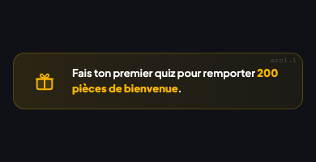 | Jamais fait de quiz · bonus 200 pièces pas encore obtenu | 1 | — | 1 |
| arc1.3 | 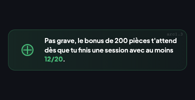 | 1 session faite · bonus 200 pièces non obtenu (score < 60 %) | 1 | — | 2 |
| arc1.4 | 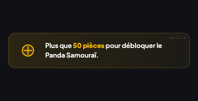 | Entre 200 et 249 pièces · aucun personnage possédé | 1 | — | 21 |
| arc1.5 | 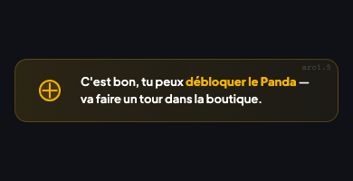 | 250 pièces ou plus · aucun personnage possédé | 1 | — | 20 |
| arc1.7.streak5 | 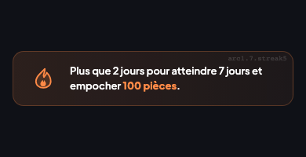 | Flamme exactement à 5 jours | 1 | — | 29 |
| arc1.7.streak6 | 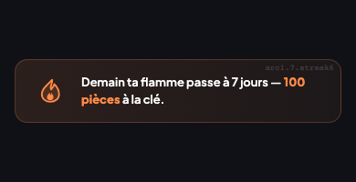 | Flamme exactement à 6 jours | 1 | — | 30 |

---

### Progression vers Argent

| <abbr title="Identifiant de l'arc dans coaching.js">Arc</abbr> | <abbr title="Texte affiché dans le bandeau de motivation">Aperçu</abbr> | <abbr title="Règle de déclenchement">Condition</abbr> | <abbr title="Nombre maximum d'affichages (one-shot) · ↩ = récurrent, peut réapparaître indéfiniment">Type</abbr> | <abbr title="Délai minimum avant réaffichage · — = one-shot, ne réapparaît jamais · 3 min = cooldown global entre deux messages">Cooldown</abbr> | <abbr title="Rang dans pickCoachingMessage(), 1 = le plus prioritaire">Priorité</abbr> |
|-----|--------|-----------|:----:|:-------:|:--------:|
| arc2.1 | 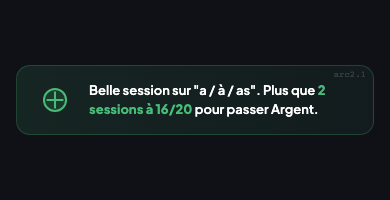 | Une règle niveau Argent · 1 session guidée ≥ 16/20 sur cette règle | 1 | — | 10 |
| arc2.2 | 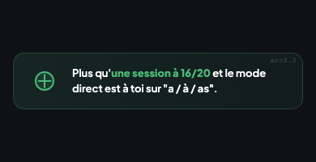 | Une règle niveau Argent · 2 sessions guidées ≥ 16/20 sur cette règle | 1 | — | 11 |
| arc2.4 | 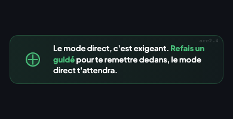 | Une règle niveau Argent · session directe faite · aucune ≥ 16/20 | 1 | — | 35 |

---

### Progression vers Couronne

| <abbr title="Identifiant de l'arc dans coaching.js">Arc</abbr> | <abbr title="Texte affiché dans le bandeau de motivation">Aperçu</abbr> | <abbr title="Règle de déclenchement">Condition</abbr> | <abbr title="Nombre maximum d'affichages (one-shot) · ↩ = récurrent, peut réapparaître indéfiniment">Type</abbr> | <abbr title="Délai minimum avant réaffichage · — = one-shot, ne réapparaît jamais · 3 min = cooldown global entre deux messages">Cooldown</abbr> | <abbr title="Rang dans pickCoachingMessage(), 1 = le plus prioritaire">Priorité</abbr> |
|-----|--------|-----------|:----:|:-------:|:--------:|
| arc3.1 | 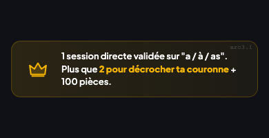 | Une règle niveau Argent · 1 session directe ≥ 16/20 | 1 | — | 8 |
| arc3.2 | 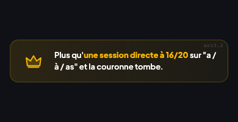 | Une règle niveau Argent · 2 sessions directes ≥ 16/20 | 1 | — | 9 |
| arc3.4 | 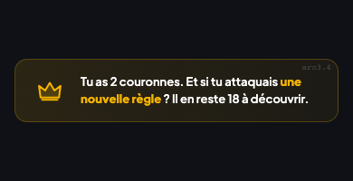 | 2 couronnes ou plus · moins de la moitié des règles au niveau Bronze | 1 | — | 34 |

---

### Progression vers Diamant

| <abbr title="Identifiant de l'arc dans coaching.js">Arc</abbr> | <abbr title="Texte affiché dans le bandeau de motivation">Aperçu</abbr> | <abbr title="Règle de déclenchement">Condition</abbr> | <abbr title="Nombre maximum d'affichages (one-shot) · ↩ = récurrent, peut réapparaître indéfiniment">Type</abbr> | <abbr title="Délai minimum avant réaffichage · — = one-shot, ne réapparaît jamais · 3 min = cooldown global entre deux messages">Cooldown</abbr> | <abbr title="Rang dans pickCoachingMessage(), 1 = le plus prioritaire">Priorité</abbr> |
|-----|--------|-----------|:----:|:-------:|:--------:|
| arc4.1 | 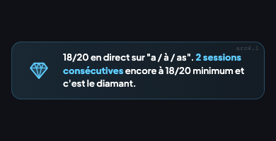 | Une règle Couronne · 1 session directe consécutive ≥ 18/20 | 1 | — | 6 |
| arc4.2 | 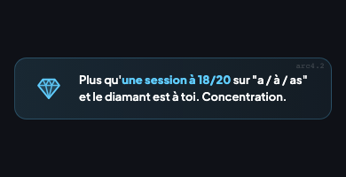 | Une règle Couronne · 2 sessions directes consécutives ≥ 18/20 | 1 | — | 7 |
| arc4.5 | 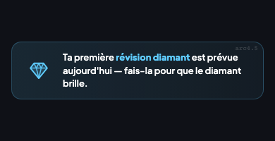 | Une règle Diamant · révision prévue aujourd'hui | 1 | — | 5 |
| arc4.8 | 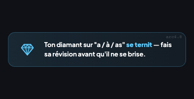 | Une règle Diamant · date de révision dépassée | 1 | — | 4 |

---

### Flamme et série

| <abbr title="Identifiant de l'arc dans coaching.js">Arc</abbr> | <abbr title="Texte affiché dans le bandeau de motivation">Aperçu</abbr> | <abbr title="Règle de déclenchement">Condition</abbr> | <abbr title="Nombre maximum d'affichages (one-shot) · ↩ = récurrent, peut réapparaître indéfiniment">Type</abbr> | <abbr title="Délai minimum avant réaffichage · — = one-shot, ne réapparaît jamais · 3 min = cooldown global entre deux messages">Cooldown</abbr> | <abbr title="Rang dans pickCoachingMessage(), 1 = le plus prioritaire">Priorité</abbr> |
|-----|--------|-----------|:----:|:-------:|:--------:|
| arc5.1 | 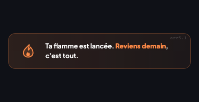 | Flamme exactement à 1 jour | 1 | — | 32 |
| arc5.2 | 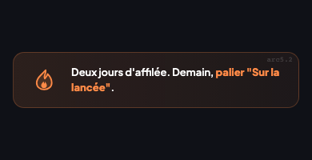 | Flamme exactement à 2 jours | 1 | — | 33 |
| arc5.3 | 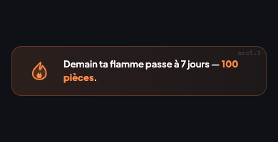 | Flamme à 6 jours · pas encore joué aujourd'hui | 1 | — | 31 |
| arc5.8 | 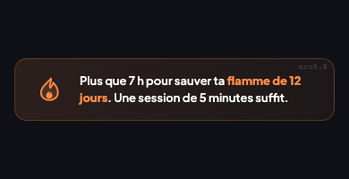 | Flamme active · pas joué aujourd'hui · après 16 h | ↩ | 3 min | 3 |
| arc5.9 | 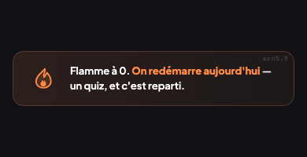 | Flamme à 0 · ou flamme à 1 après en avoir eu une plus longue | 1 | — | 34 |

---

### Bouclier

| <abbr title="Identifiant de l'arc dans coaching.js">Arc</abbr> | <abbr title="Texte affiché dans le bandeau de motivation">Aperçu</abbr> | <abbr title="Règle de déclenchement">Condition</abbr> | <abbr title="Nombre maximum d'affichages (one-shot) · ↩ = récurrent, peut réapparaître indéfiniment">Type</abbr> | <abbr title="Délai minimum avant réaffichage · — = one-shot, ne réapparaît jamais · 3 min = cooldown global entre deux messages">Cooldown</abbr> | <abbr title="Rang dans pickCoachingMessage(), 1 = le plus prioritaire">Priorité</abbr> |
|-----|--------|-----------|:----:|:-------:|:--------:|
| arc13.1 | 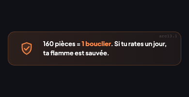 | Flamme < 3 jours · 0 bouclier · 160 pièces ou plus | 1 | — | 19 |
| arc13.2 | 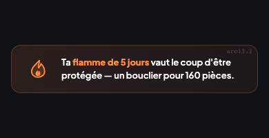 | Flamme entre 3 et 6 jours · 0 bouclier · 160 pièces ou plus | 1 | — | 17 |
| arc13.3 | 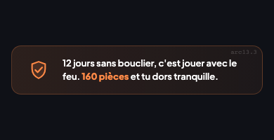 | Flamme ≥ 7 jours · 0 bouclier · 160 pièces ou plus | 1 | — | 16 |
| arc13.4 | 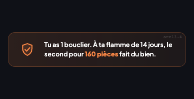 | Flamme ≥ 14 jours · 1 bouclier · 160 pièces ou plus | 1 | — | 18 |

---

### Boutique et achats

| <abbr title="Identifiant de l'arc dans coaching.js">Arc</abbr> | <abbr title="Texte affiché dans le bandeau de motivation">Aperçu</abbr> | <abbr title="Règle de déclenchement">Condition</abbr> | <abbr title="Nombre maximum d'affichages (one-shot) · ↩ = récurrent, peut réapparaître indéfiniment">Type</abbr> | <abbr title="Délai minimum avant réaffichage · — = one-shot, ne réapparaît jamais · 3 min = cooldown global entre deux messages">Cooldown</abbr> | <abbr title="Rang dans pickCoachingMessage(), 1 = le plus prioritaire">Priorité</abbr> |
|-----|--------|-----------|:----:|:-------:|:--------:|
| arc6.1 | 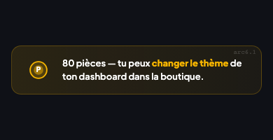 | 80 pièces ou plus · aucun thème acheté | 1 | — | 28 |
| arc6.3 | 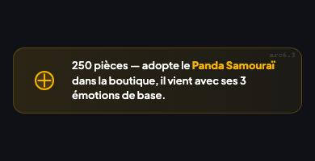 | 250 pièces ou plus · aucun personnage possédé | 1 | — | 22 |
| arc6.4 | 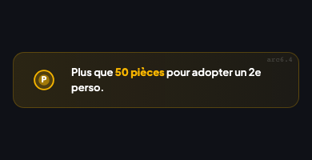 | Entre 450 et 499 pièces · au moins 1 personnage | 1 | — | 23 |
| arc6.5 | 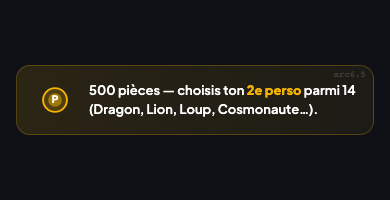 | 500 pièces ou plus · exactement 1 personnage | 1 | — | 24 |
| arc6.6 | 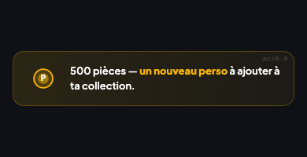 | 500 pièces ou plus · 2 personnages ou plus | 1 | — | 26 |
| arc6.7 | 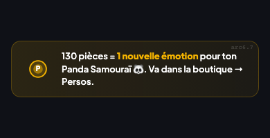 | Assez de pièces pour une émotion · personnage sans aucune émotion | 1 | — | 25 |
| arc6.8 | 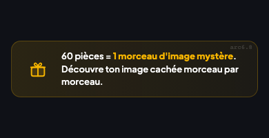 | 60 pièces ou plus · aucun morceau d'image mystère dévoilé | 1 | — | 36 |
| arc6.9 | 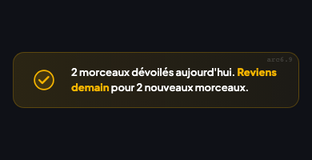 | 2 morceaux d'image mystère dévoilés aujourd'hui | 1 | — | 49 |
| arc6.10 | 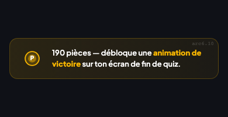 | 190 pièces ou plus · aucune animation de victoire | 1 | — | 37 |
| arc6.11 | 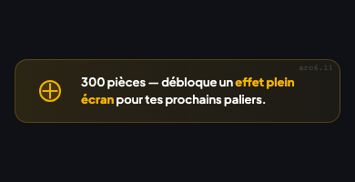 | 300 pièces ou plus · aucune animation d'entrée | 1 | — | 38 |
| arc6.12 | 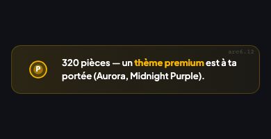 | 320 pièces ou plus · aucun thème premium | 1 | — | 39 |
| arc6.13 | 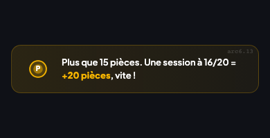 | Moins de 30 pièces · flamme active | 1 | — | 27 |

---

### Boosts

| <abbr title="Identifiant de l'arc dans coaching.js">Arc</abbr> | <abbr title="Texte affiché dans le bandeau de motivation">Aperçu</abbr> | <abbr title="Règle de déclenchement">Condition</abbr> | <abbr title="Nombre maximum d'affichages (one-shot) · ↩ = récurrent, peut réapparaître indéfiniment">Type</abbr> | <abbr title="Délai minimum avant réaffichage · — = one-shot, ne réapparaît jamais · 3 min = cooldown global entre deux messages">Cooldown</abbr> | <abbr title="Rang dans pickCoachingMessage(), 1 = le plus prioritaire">Priorité</abbr> |
|-----|--------|-----------|:----:|:-------:|:--------:|
| arc7.1 | 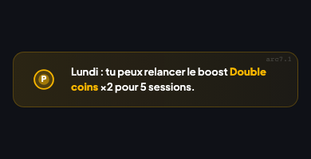 | Lundi · 100 pièces ou plus · aucun boost Double coins actif | 1 | — | 40 |
| arc7.2 | 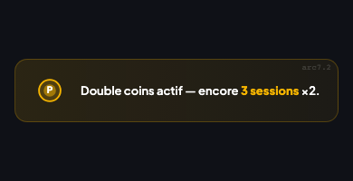 | Boost Double coins actif avec des sessions restantes | ↩ | 3 min | 41 |

---

### Dictée

| <abbr title="Identifiant de l'arc dans coaching.js">Arc</abbr> | <abbr title="Texte affiché dans le bandeau de motivation">Aperçu</abbr> | <abbr title="Règle de déclenchement">Condition</abbr> | <abbr title="Nombre maximum d'affichages (one-shot) · ↩ = récurrent, peut réapparaître indéfiniment">Type</abbr> | <abbr title="Délai minimum avant réaffichage · — = one-shot, ne réapparaît jamais · 3 min = cooldown global entre deux messages">Cooldown</abbr> | <abbr title="Rang dans pickCoachingMessage(), 1 = le plus prioritaire">Priorité</abbr> |
|-----|--------|-----------|:----:|:-------:|:--------:|
| arc8.1 | 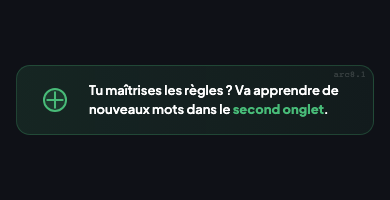 | Au moins une règle au niveau Bronze ou au-dessus | 1 | — | 42 |

---

### Retour après absence

| <abbr title="Identifiant de l'arc dans coaching.js">Arc</abbr> | <abbr title="Texte affiché dans le bandeau de motivation">Aperçu</abbr> | <abbr title="Règle de déclenchement">Condition</abbr> | <abbr title="Nombre maximum d'affichages (one-shot) · ↩ = récurrent, peut réapparaître indéfiniment">Type</abbr> | <abbr title="Délai minimum avant réaffichage · — = one-shot, ne réapparaît jamais · 3 min = cooldown global entre deux messages">Cooldown</abbr> | <abbr title="Rang dans pickCoachingMessage(), 1 = le plus prioritaire">Priorité</abbr> |
|-----|--------|-----------|:----:|:-------:|:--------:|
| arc9.5 | 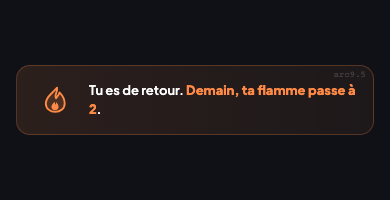 | Flamme à 1 jour · flamme record plus longue dans le passé | 1 | — | 43 |

---

### Maîtrise complète

| <abbr title="Identifiant de l'arc dans coaching.js">Arc</abbr> | <abbr title="Texte affiché dans le bandeau de motivation">Aperçu</abbr> | <abbr title="Règle de déclenchement">Condition</abbr> | <abbr title="Nombre maximum d'affichages (one-shot) · ↩ = récurrent, peut réapparaître indéfiniment">Type</abbr> | <abbr title="Délai minimum avant réaffichage · — = one-shot, ne réapparaît jamais · 3 min = cooldown global entre deux messages">Cooldown</abbr> | <abbr title="Rang dans pickCoachingMessage(), 1 = le plus prioritaire">Priorité</abbr> |
|-----|--------|-----------|:----:|:-------:|:--------:|
| arc10.1 | 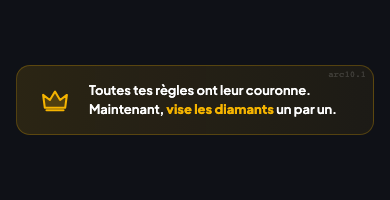 | Toutes les règles au niveau Couronne ou Diamant | 1 | — | 44 |
| arc10.2 | 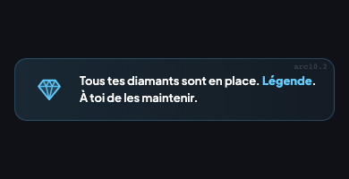 | Toutes les règles au niveau Diamant | 1 | — | 45 |
| arc10.3 | 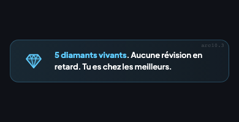 | 5 règles Diamant ou plus · toutes à jour · aucune révision due | 1 | — | 46 |
| arc10.4 | 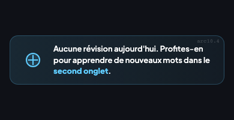 | Au moins une règle Diamant · aucune révision due aujourd'hui | 1 | — | 47 |

---

### Images mystère

| <abbr title="Identifiant de l'arc dans coaching.js">Arc</abbr> | <abbr title="Texte affiché dans le bandeau de motivation">Aperçu</abbr> | <abbr title="Règle de déclenchement">Condition</abbr> | <abbr title="Nombre maximum d'affichages (one-shot) · ↩ = récurrent, peut réapparaître indéfiniment">Type</abbr> | <abbr title="Délai minimum avant réaffichage · — = one-shot, ne réapparaît jamais · 3 min = cooldown global entre deux messages">Cooldown</abbr> | <abbr title="Rang dans pickCoachingMessage(), 1 = le plus prioritaire">Priorité</abbr> |
|-----|--------|-----------|:----:|:-------:|:--------:|
| arc11.1 | 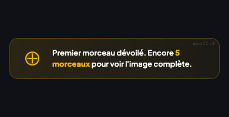 | Exactement 1 morceau dévoilé dans une collection | 1 | — | 48 |
| arc11.2 | 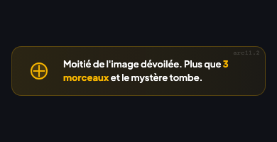 | Exactement 3 morceaux dévoilés dans une collection | 1 | — | 48 |
| arc11.3 | 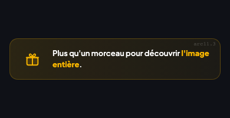 | Exactement 5 morceaux dévoilés dans une collection | 1 | — | 48 |
| arc11.4 | 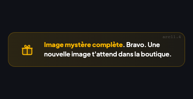 | 6 morceaux dévoilés ou plus (collection complète) | 1 | — | 48 |

---

### Personnages et émotions

| <abbr title="Identifiant de l'arc dans coaching.js">Arc</abbr> | <abbr title="Texte affiché dans le bandeau de motivation">Aperçu</abbr> | <abbr title="Règle de déclenchement">Condition</abbr> | <abbr title="Nombre maximum d'affichages (one-shot) · ↩ = récurrent, peut réapparaître indéfiniment">Type</abbr> | <abbr title="Délai minimum avant réaffichage · — = one-shot, ne réapparaît jamais · 3 min = cooldown global entre deux messages">Cooldown</abbr> | <abbr title="Rang dans pickCoachingMessage(), 1 = le plus prioritaire">Priorité</abbr> |
|-----|--------|-----------|:----:|:-------:|:--------:|
| arc12.2 | 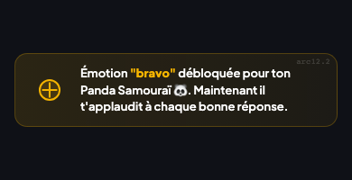 | Première émotion boutique achetée | 1 | — | 12 |
| arc12.3 |  | Un personnage avec 1 ou 2 émotions sur 7 | 1 | — | 13 |
| arc12.4 |  | Un personnage avec exactement 4 émotions sur 7 | 1 | — | 14 |
| arc12.5 |  | Un personnage avec les 7 émotions complètes | 1 | — | 15 |

---

### Sessions du jour

Ces messages sont évalués en **dernier** (priorité 50+). Ils ne s'affichent que si aucun autre arc plus prioritaire n'est éligible.

| <abbr title="Identifiant de l'arc dans coaching.js">Arc</abbr> | <abbr title="Texte affiché dans le bandeau de motivation">Aperçu</abbr> | <abbr title="Règle de déclenchement">Condition</abbr> | <abbr title="Nombre maximum d'affichages (one-shot) · ↩ = récurrent, peut réapparaître indéfiniment">Type</abbr> | <abbr title="Délai minimum avant réaffichage · — = one-shot, ne réapparaît jamais · 3 min = cooldown global entre deux messages">Cooldown</abbr> | <abbr title="Rang dans pickCoachingMessage(), 1 = le plus prioritaire">Priorité</abbr> |
|-----|--------|-----------|:----:|:-------:|:--------:|
| arc14.0a |  | Pas encore joué aujourd'hui · flamme active · dernier message affiché ≠ arc14.0a | ↩ | 3 min | 51 |
| arc14.0b |  | Pas encore joué aujourd'hui · dernier message affiché ≠ arc14.0b | ↩ | 3 min | 52 |
| arc14.1 |  | Exactement 1 session aujourd'hui · flamme ≥ 2 jours | ↩ | 3 min | 58 |
| arc14.2 |  | Exactement 2 sessions aujourd'hui | ↩ | 3 min | 57 |
| arc14.3 |  | Exactement 3 sessions aujourd'hui | ↩ | 3 min | 56 |
| arc14.4 |  | 3 sessions ou plus aujourd'hui · plus qu'hier · hier > 0 | ↩ | 3 min | 55 |
| arc14.5 |  | 4 sessions ou plus aujourd'hui · record battu sur 3, 7 ou 30 jours | ↩ | 3 min | 53 |
| arc14.6 |  | 3 sessions ou plus aujourd'hui · à 1 ou 2 sessions d'un record | ↩ | 3 min | 54 |

---

## Règles

| ID | Règle | Critère de succès |
|----|-------|-------------------|
| C01 | Un nouveau joueur voit le message de bienvenue | Le message "premier quiz" s'affiche quand aucune session n'a été faite |
| C02 | Un message déjà vu ne réapparaît pas | Après affichage, il ne revient plus |
| C03 | La flamme en danger alerte après 16h | Le soir, si le joueur n'a pas joué et a une flamme active, l'alerte apparaît |
| C04 | Pas d'alerte flamme avant 16h | L'alerte n'apparaît pas avant 16h |
| C05 | Les messages uniques sont marqués définitivement | Un message unique ne revient jamais |
| C06 | Les messages récurrents peuvent revenir | Un message récurrent peut réapparaître plus tard |
| C07 | Le compteur de messages repart à zéro chaque jour | Le lendemain, le compteur est réinitialisé |
| C08 | L'écran de fin ne montre que certains messages | Seuls les messages de progression apparaissent après un quiz |
| C09 | Le message de bienvenue est réservé au dashboard | Il n'apparaît jamais sur l'écran de fin |
| C10 | Le message le plus prioritaire gagne | Quand deux messages sont éligibles, le plus prioritaire est choisi |
| C11 | Assez de pièces sans personnage → suggestion | Le joueur avec 250+ pièces et 0 personnage reçoit une suggestion |
| C12 | Longue série sans bouclier → alerte | Le joueur avec 7+ jours et 0 bouclier voit un message d'alerte |
| C13 | Perte de la flamme → réconfort | Le joueur dont la flamme est tombée voit un encouragement |
| C14 | Le total de sessions est bien calculé | La somme des sessions de toutes les règles est correcte |
| C15 | Seuls les personnages sont comptés | Les émotions et thèmes ne comptent pas comme personnages |
| C16 | Les émotions sont filtrées par personnage | Les émotions du dragon ne comptent pas dans celles du panda |
| N13 | Nudge matin avec flamme active | Le matin sans session et avec une flamme, un message de rappel est affiché |
| N33 | Le personnage associé à une règle est stable par jour | Le même personnage est affiché pour la même règle le même jour |

## Voir aussi

- [Dashboard enfant](03-dashboard-enfant.md)
- [Flamme et série](04-flamme-serie.md)
- [Économie et récompenses](14-economie-recompenses.md)
- [Boutique](11-boutique.md)
- [Personnages](12-personnages.md)
