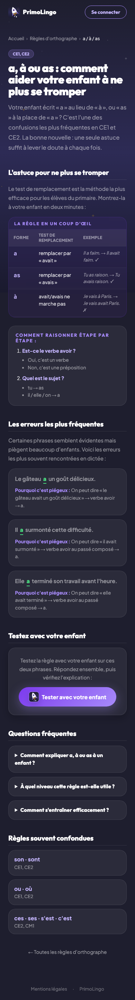

# Pages publiques et SEO

## Description

Les pages publiques permettent aux parents de decouvrir PrimoLingo via les moteurs de recherche. Une page d'accueil presente l'app, un index liste les 20 regles disponibles, et chaque regle a sa propre page avec une explication detaillee, un mini-quiz gratuit de 2 questions et un appel a l'inscription.

## Parcours utilisateur

### Page d'accueil

La page d'accueil est la vitrine de PrimoLingo. Elle presente le concept de l'app, ses benefices pour l'enfant et un bouton d'inscription bien visible.

### Index des regles

La page `/regles` affiche les 20 regles d'orthographe sous forme de cartes. Chaque carte montre le nom de la regle et un badge de niveau. En cliquant sur une carte, le parent accede a la page detaillee de la regle.

### Page d'une regle

Chaque regle a sa propre page (par exemple `/regles/a-a-as`). Le titre est oriente vers le parent (il mentionne l'aide apportee a l'enfant). La page contient :

- Une **fiche memo** avec un tableau forme / test / exemple pour comprendre la regle
- Des explications claires et accessibles
- Un **mini-quiz gratuit** de 2 questions pour que le parent (ou l'enfant) puisse tester ses connaissances

### Mini-quiz et appel a l'inscription

Le mini-quiz se deroule en quelques secondes :

1. L'utilisateur clique sur "Commencer"
2. Il repond a la premiere question et voit le feedback
3. Il repond a la deuxieme question et voit le feedback
4. Son score s'affiche
5. Un **appel a l'inscription** (CTA) l'invite a creer un compte pour acceder a toutes les regles et au jeu complet

Ce portail CTA est le point de conversion principal : apres avoir goute au quiz, le parent est invite a inscrire son enfant.

### Navigation

La navigation entre les pages est fluide :
- Depuis l'index, cliquer sur une carte mene a la page de la regle
- Un fil d'ariane (breadcrumb) permet de revenir a l'index
- Les pages inexistantes redirigent automatiquement vers l'index

### Referencement

Chaque page possede les balises necessaires au bon referencement : titre, description, lien canonique et balises pour les reseaux sociaux.

## Regles

| ID | Regle | Critere de succes |
|----|-------|-------------------|
| SEO01 | L'index affiche 20 regles | La page /regles montre 20 cartes de regles avec badges de niveau |
| SEO02 | Le titre est oriente parent | Le titre mentionne "enfant" ou "aider" |
| SEO03 | La fiche memo est visible | Le tableau forme / test / exemple est affiche sur la page |
| SEO04 | Le mini-quiz fonctionne de bout en bout | Demarrage, question 1, feedback, question 2, score, appel a l'inscription |
| SEO05 | Les balises de referencement sont correctes | Titre, description, lien canonique et balises reseaux sociaux sont presents |
| SEO06 | La navigation interne fonctionne | Clic carte mene a la page, fil d'ariane ramene a l'index, page inexistante redirige |

## Voir aussi

- [Inscription et connexion](./01-inscription-connexion.md)
